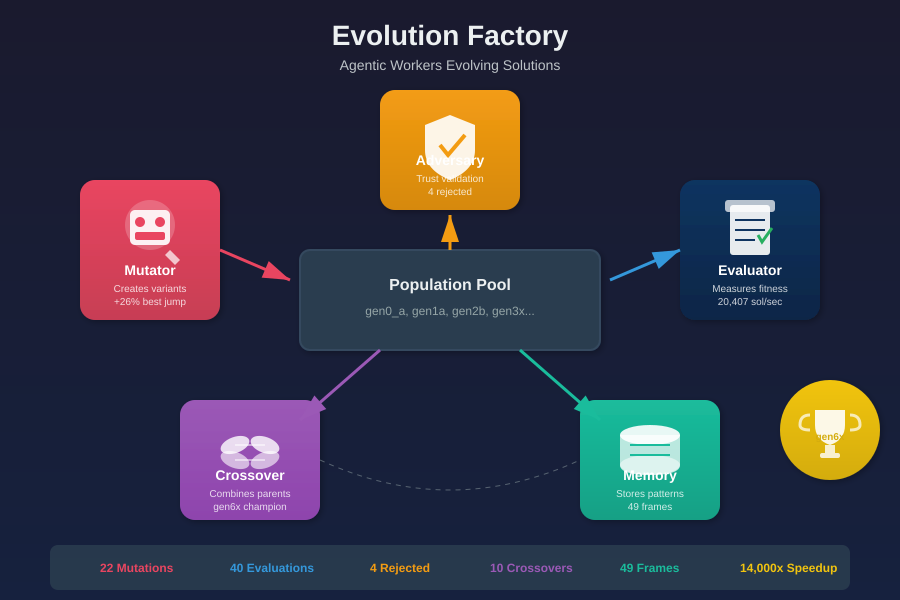

# Agentic Evolve

**Evolutionary algorithm discovery powered by Claude.** Evolves novel solutions through LLM-driven mutation, crossover, and selection—optimizing for speed, size, or ML accuracy.



## Features

- **Three optimization modes**: Performance (ops/sec), Size (bytes), ML (F1/accuracy)
- **Hierarchical agents**: Dedicated subagents for mutation, crossover, evaluation, and adversary review
- **Evolution Memory**: Persistent storage of mutation patterns, failures, and checkpoints for cross-problem learning
- **Trust System**: Adversary agent reviews suspicious improvements, prevents evaluator exploitation
- **Clean context**: Each agent starts fresh, avoiding context bloat
- **Parallel mutations**: Run multiple mutation attempts concurrently
- **Crash recovery**: Checkpoint system enables resuming from any generation
- **Validation hooks**: Block unsafe code patterns before execution

## Quick Start

### 1. Install the SDK

```bash
# Create virtual environment (recommended)
python3 -m venv .venv
source .venv/bin/activate

# Install the SDK and dependencies
pip install -e sdk/
pip install claude-agent-sdk
```

### 2. Install the Skills (optional)

```bash
# Copy skills to your Claude commands directory
cp .claude/commands/evolve*.md ~/.claude/commands/
```

### 3. Use It

**Via CLI:**
```bash
# Activate venv first
source .venv/bin/activate

# Performance optimization
python -m evolve_sdk "faster sorting algorithm" --mode=perf

# Size optimization (code golf)
python -m evolve_sdk "shortest Python prime checker" --mode=size

# ML optimization
python -m evolve_sdk "improve F1 for classification" --mode=ml

# With memory enabled (default)
python -m evolve_sdk "faster N-Queens solver" --mode=perf --config=evolve_config.json

# Resume previous evolution
python -m evolve_sdk --resume
```

**Via Claude Code skill:**
```
/evolve faster sorting algorithm
/evolve shortest Python solution for ARC task
/evolve improve accuracy on this classifier
/evolve --resume
```

## Architecture

```
┌───────────────────────────────────────────────────────────────────────────┐
│                          Evolution Factory                                 │
│                                                                           │
│  ┌──────────┐  ┌──────────┐  ┌──────────┐  ┌──────────┐  ┌──────────┐   │
│  │ Mutator  │  │ Debugger │  │ Evaluator│  │ Adversary│  │ Crossover│   │
│  │  Agent   │  │  Agent   │  │  Agent   │  │  Agent   │  │  Agent   │   │
│  │          │  │          │  │          │  │          │  │          │   │
│  │ Creates  │  │ Diagnoses│  │ Measures │  │ Validates│  │ Combines │   │
│  │ variants │  │ failures │  │ fitness  │  │  trust   │  │ parents  │   │
│  └────┬─────┘  └────┬─────┘  └────┬─────┘  └────┬─────┘  └────┬─────┘   │
│       │             │             │             │             │          │
│       └─────────────┴─────────────┴─────────────┴─────────────┘          │
│                                   │                                       │
│                                   ▼                                       │
│                        ┌──────────────────┐                              │
│                        │  Population Pool │                              │
│                        │                  │                              │
│                        │ gen0_a, gen1a,   │                              │
│                        │ gen2b, gen3x...  │                              │
│                        └────────┬─────────┘                              │
│                                 │                                         │
│            ┌────────────────────┼────────────────────┐                   │
│            ▼                    ▼                    ▼                   │
│  ┌──────────────────┐  ┌──────────────────┐  ┌──────────────────┐       │
│  │  Memory Store    │  │ Plateau Breaker  │  │  Reporter Agent  │       │
│  │                  │  │     Agent        │  │                  │       │
│  │ Mutations, fails,│  │                  │  │ Surfaces msgs to │       │
│  │ checkpoints      │  │ Escapes local    │  │ human operator   │       │
│  │                  │  │ optima           │  │                  │       │
│  └──────────────────┘  └──────────────────┘  └──────────────────┘       │
│                                                                           │
│  Stop when: plateau OR max generations OR budget exhausted               │
└───────────────────────────────────────────────────────────────────────────┘
```

## Evolution Memory System

The memory system provides persistent storage for evolution runs, enabling:

### What Memory Captures

| Frame Type | Purpose |
|------------|---------|
| **mutation** | Tracks all mutation attempts with fitness deltas and tags |
| **failed_mutation** | Records rejected mutations and reasons for future avoidance |
| **checkpoint** | Enables crash recovery from any generation |
| **generation** | Summarizes each generation's progress |
| **champion** | Records winning solutions with full lineage |
| **trust_decision** | Logs adversary reviews and trust scores |

### Memory Configuration

```json
{
  "memory": {
    "enabled": true,
    "inject_mutation_context": true,
    "store_successful_mutations": true,
    "store_failed_mutations": true,
    "max_similar_mutations": 5,
    "max_failed_mutations": 5
  }
}
```

### Benefits

- **Pattern Learning**: Mutators receive context about what worked before
- **Failure Avoidance**: Don't repeat mutations that already failed
- **Crash Recovery**: Resume from any checkpoint after system failure
- **Cross-Problem Learning**: Transfer patterns between similar problems

## Optimization Modes

| Mode | Metric | Use Case |
|------|--------|----------|
| **perf** | ops/sec, latency | Algorithm optimization, benchmarks |
| **size** | bytes, characters | Code golf, minimal implementations |
| **ml** | F1, accuracy, AUC | Feature engineering, model tuning |

## Example Results

| Problem | Mode | Result | Improvement |
|---------|------|--------|-------------|
| **N-Queens** | perf | 20,407 sol/sec | **14,000x** vs baseline |
| KV-Cache Eviction | perf | 6.65% error reduction | Layer-aware scoring |
| hERG Toxicity | ml | 0.890 ROC-AUC | +4.5% from baseline |
| ARC task 0520fde7 | size | 57 bytes | -29% from baseline |
| Bin Packing | perf | Weibull 5K benchmark | Novel heuristics |

## Showcases

| Showcase | Description | Key Result |
|----------|-------------|------------|
| [regex_golf](showcase/regex_golf/) | Debugger + Plateau Breaker demo | 33% failure diagnosis |
| [nqueens-evolution](showcase/nqueens-evolution/) | N-Queens solver with memory demo | 14,000x speedup |
| [kv-cache-eviction](showcase/kv-cache-eviction/) | LLM KV-cache eviction policy | 6.65% improvement |
| [molecular-admet-prediction](showcase/molecular-admet-prediction/) | hERG cardiac toxicity | 0.890 ROC-AUC |
| [code-golf](showcase/code-golf/) | ARC-AGI minimal solutions | 75+ tasks solved |
| [santa-2025-packing](showcase/santa-2025-packing/) | Kaggle bin packing | Competition entry |
| [kernelbench-triton-evolution](showcase/kernelbench-triton-evolution/) | GPU kernel optimization | Triton kernels |

## Project Structure

```
agentic-evolve/
├── .claude/commands/           # Skill files (thin SDK wrappers)
│   ├── evolve.md              # Master dispatcher
│   ├── evolve-perf.md         # Performance mode
│   ├── evolve-size.md         # Size mode
│   └── evolve-ml.md           # ML mode
├── sdk/                        # Python SDK
│   └── evolve_sdk/
│       ├── runner.py          # EvolutionRunner orchestrator
│       ├── config.py          # Configuration handling
│       ├── agents/            # Subagent prompts
│       │   ├── mutator.py     # Mutation specialist
│       │   ├── evaluator.py   # Fitness measurement
│       │   ├── crossover.py   # Parent combination
│       │   ├── adversary.py   # Trust validation
│       │   ├── debugger.py    # Failed mutation diagnosis
│       │   └── plateau_breaker.py  # Stall detection/intervention
│       ├── memory/            # Evolution memory system
│       │   ├── store.py       # Persistent storage engine
│       │   ├── schemas.py     # Frame type definitions
│       │   ├── queries.py     # Pre-built query patterns
│       │   └── embeddings.py  # Code similarity matching
│       └── hooks/             # Validation hooks
├── showcase/                   # Example evolution runs
│   ├── nqueens-evolution/     # Memory system demo (14,000x speedup)
│   ├── kv-cache-eviction/     # KV-cache scoring (6.65% improvement)
│   ├── molecular-admet-prediction/ # hERG toxicity (0.890 ROC-AUC)
│   ├── code-golf/             # ARC-AGI solutions (75+ tasks)
│   └── ...
└── .evolve-sdk/                # Evolution state (created per run)
    └── <problem>/
        ├── evolution.json      # Full state + memory frames
        ├── champion.json       # Best solution
        ├── trust_dossier.md    # Trust decision report
        └── mutations/          # All tested variants
```

## Trust System

The SDK includes adversarial validation to prevent evaluator gaming:

| Component | Purpose |
|-----------|---------|
| **Adversary Agent** | Reviews suspicious improvements (>15% jumps) |
| **Variance Gates** | Re-evaluates N times, rejects inconsistent results |
| **Exploit Detection** | Checks timing anomalies, output integrity |
| **Trust Dossier** | Generates markdown reports of all decisions |
| **Escalation Levels** | Extended validation for high-stakes promotions |

```json
{
  "trust": {
    "enabled": true,
    "suspicious_jump_pct": 15.0,
    "require_adversary_for_champion": true,
    "n_evaluations": 3,
    "variance_threshold": 0.05
  }
}
```

## Configuration

Use `evolve_config.json` for custom evaluation:

```json
{
  "description": "Evolve fast N-Queens solvers",
  "mode": "perf",
  "evaluation": {
    "test_command": "python evaluate.py {solution} --json"
  },
  "memory": {
    "enabled": true,
    "inject_mutation_context": true
  },
  "trust": {
    "enabled": true,
    "require_adversary_for_champion": true
  },
  "starter_solutions": ["baseline.py"],
  "max_generations": 20,
  "population_size": 10
}
```

Then run:
```bash
python -m evolve_sdk --config=evolve_config.json
```

## Requirements

- Python 3.10+
- Claude Code CLI (`brew install claude-code`)
- Claude Agent SDK (`pip install claude-agent-sdk`)
- Authenticated with Claude (`claude auth login`)

## License

MIT
