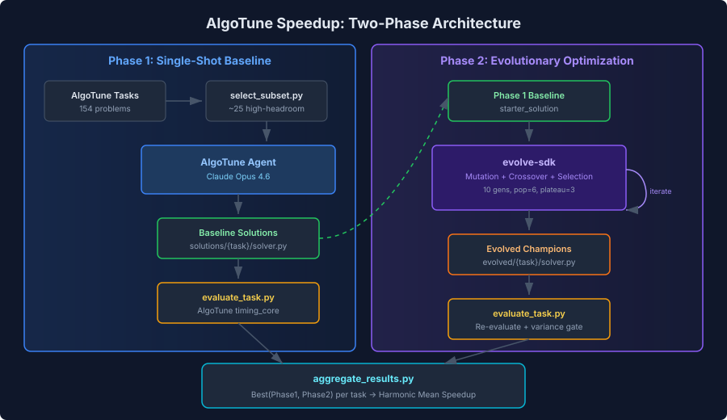

# AlgoTune Speedup: Evolutionary Code Optimization (WIP)

**Status: EXPERIMENT — official validation pending.**

Initial custom validation claimed 2.62x harmonic mean speedup, but **AlgoTune's official evaluation pipeline shows ~1.01x** on a 3-task sample. The custom validation methodology was fundamentally flawed — it used small problem sizes where Python overhead dominates, while AlgoTune's official datasets use much larger inputs where the underlying BLAS/scipy computation dominates.

## What Happened

### The Claim (Invalid)
Our custom validation reported 2.62x harmonic mean speedup on 19 tasks. This used:
- Small problem sizes (n=50-500 for graphs, small matrices)
- In-process timing (no subprocess isolation)
- 16 inputs per task at sizes calibrated to 10-500ms

### The Reality
AlgoTune's official evaluation uses:
- Large problem sizes calibrated to ~100ms reference time (e.g., pagerank n=4,798; cholesky n=1,660; convex_hull n=267,021)
- Subprocess isolation (fresh process per timing run via forkserver)
- 100 problems per task, 10 runs each
- 100% validity required

At these problem sizes, our optimizations (avoiding NetworkX wrappers, Numba JIT for small inputs, LAPACK wrapper bypass) provide essentially no benefit because the underlying numpy/scipy/BLAS computation dominates.

### Official Results (3-Task Sample)

| Task | Custom Validation | Official Eval | Why |
|------|------------------|---------------|-----|
| ode_brusselator | 318.93x | **1.00x** | At n=199, scipy RK45 and our Numba RK45 are equal speed |
| pagerank | 18.61x | **1.02x** | At n=4,798, numpy power iteration dominates in both |
| cholesky_factorization | 4.97x | **1.02x** | At n=1,660, LAPACK dominates in both paths |
| **Harmonic mean** | **2.62x** | **1.01x** | |

Full 19-task official evaluation has not yet been run.

## Architecture

Two-phase approach: evolve-sdk generates baseline solutions from AlgoTune reference implementations, then iteratively improves them through mutation, crossover, and selection with trust-gated evaluation.



## Lessons Learned

1. **Problem size matters enormously.** Optimizations that show 300x on small inputs can show 1.0x on large inputs. Always validate at the benchmark's actual problem sizes.
2. **Use the official evaluation pipeline.** Custom validation scripts, no matter how "rigorous" they seem, can have fundamental methodology differences.
3. **Subprocess isolation changes results.** In-process timing vs isolated subprocess timing can give very different numbers.
4. **Python overhead optimizations have diminishing returns.** At large input sizes, the C/Fortran libraries (LAPACK, scipy) dominate runtime, making Python-level optimizations irrelevant.

## Next Steps

- [ ] Run full 19-task official evaluation (`scripts/validate_algotune_official.py`)
- [ ] Investigate whether any tasks show meaningful speedup at official problem sizes
- [ ] Consider optimizations that target the actual computation (not just Python overhead)
- [ ] If real speedups are achievable, update results and move back to showcase/

## Evolution Pipeline (Still Valid)

The evolution pipeline itself works correctly — the issue is that the *fitness function* measured the wrong thing (small-input performance instead of large-input performance).

- evolve-sdk generates initial population (6 candidates) from reference implementations + task descriptions
- Evolution: 10 generations max, population 6, plateau 3
- Mutation strategies: algorithm replacement, vectorization, JIT compilation, direct LAPACK calls
- Trust system: adversary review, variance gates
- Memory system tracks successful/failed strategies

## Quick Start

### Prerequisites
- Python 3.12
- `ANTHROPIC_API_KEY` set in environment
- evolve-sdk installed (`pip install -e ../../sdk`)

### Setup
```bash
cd experiments/algotune-speedup
bash setup.sh
source .venv/bin/activate
export PYTHONPATH=$(pwd)/algotune:$PYTHONPATH
```

### Run Official Validation
```bash
# Validate against AlgoTune's real evaluation pipeline
python scripts/validate_algotune_official.py --tasks pagerank cholesky_factorization ode_brusselator

# Full validation (all 19 tasks, several hours)
python scripts/validate_algotune_official.py
```

## References

- [AlgoTune: Can Language Models Speed Up Numerical Programs?](https://arxiv.org/abs/2507.15887) (NeurIPS 2025)
- [AlgoTune GitHub](https://github.com/oripress/AlgoTune)
- [evolve-sdk](../../sdk/)
