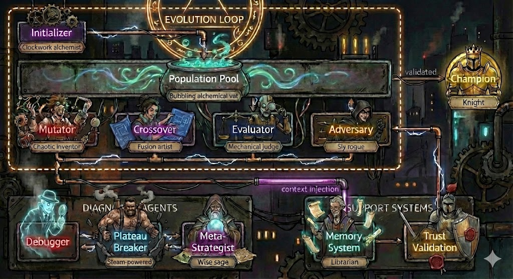

# Deceptive Landscape Escape

**Problem**: Evolution gets trapped in local optima when the fitness landscape is deceptive.

*Demonstrates the Diversity Guardian agent (Phase 3)*



## The Problem: Deceptive Fitness Landscapes

Premature convergence is a **silent killer** of evolutionary optimization:

1. Population becomes too similar too fast
2. All solutions cluster around a local optimum
3. Evolution appears to "work" but never finds the global optimum
4. Without monitoring, you don't know you're stuck

This showcase demonstrates the problem using a **deceptive fitness landscape**.

## The Deceptive Landscape

The fitness function has two attractors:

| Optimum | Pattern | Fitness | Discovery |
|---------|---------|---------|-----------|
| **Local** | High 1-density (`111111...`) | ~75 | Easy (greedy) |
| **Global** | Alternating (`101010...`) | 100 | Hard (non-obvious) |

**The Trap**: Mutations that add more 1s LOOK like improvement, but lead to the local optimum. The global optimum requires a completely different structure.

```
Fitness Landscape (simplified):

    100 |                    *  <- Global optimum (alternating)
        |
     75 |  *****              <- Local optimum (high density)
        | /    \
     50 |/      \             <- Baseline (all zeros)
        |        \
      0 +-------------------> Solution space
          greedy path         orthogonal path
```

## How Diversity Guardian Helps

### Without Diversity Guardian

```
Gen 0: Baseline (fitness 50)
Gen 1: Add some 1s (fitness 60) ↑
Gen 2: Add more 1s (fitness 70) ↑
Gen 3: Mostly 1s (fitness 75) ← STUCK
Gen 4: Still mostly 1s (fitness 75.2) ← STUCK
Gen 5: Variations of 1s (fitness 75.5) ← STUCK
...
Population converged to local optimum. Evolution continues but fitness plateaus.
```

### With Diversity Guardian

```
Gen 0: Baseline (fitness 50)
Gen 1: Add some 1s (fitness 60) ↑
Gen 2: Add more 1s (fitness 70) ↑
Gen 3: Mostly 1s (fitness 75)
       ⚠️ DIVERSITY ALERT: Genotypic=0.12, Phenotypic=0.08
       💉 Injecting orthogonal solutions...
Gen 4: [Orthogonal] Try alternating (fitness 85) ↑
Gen 5: Refine alternating (fitness 95) ↑
Gen 6: Perfect alternating (fitness 100) 🏆 GLOBAL OPTIMUM
```

## Metrics Monitored

### Genotypic Diversity (Code Similarity)
- Computed via sentence-transformer embeddings
- 0.0 = all solutions identical code
- 1.0 = all solutions maximally different
- **Alert threshold**: < 0.25

### Phenotypic Diversity (Fitness Spread)
- Coefficient of variation of fitness scores
- 0.0 = all solutions have same fitness
- 1.0 = high variance in fitness
- **Alert threshold**: < 0.20

## Quick Start

```bash
cd experiments/deceptive-landscape-escape

# Run the demonstration (no full evolution needed)
python demonstrate_diversity.py

# Evaluate a solution
python evaluate.py baseline.py --json

# Run evolution with guardian enabled
python -m evolve_sdk --config=evolve_config.json

# Run evolution without guardian (control)
python -m evolve_sdk --config=evolve_config_no_guardian.json
```

## Files

| File | Purpose |
|------|---------|
| `baseline.py` | Starting solution (all zeros, fitness 50) |
| `evaluate.py` | Deceptive fitness function |
| `evolve_config.json` | Config with Diversity Guardian enabled |
| `evolve_config_no_guardian.json` | Config without guardian (control) |
| `demonstrate_diversity.py` | Demo script showing diversity computation |

## Expected Results

| Configuration | Final Fitness | Diversity at End | Outcome |
|---------------|---------------|------------------|---------|
| No Guardian | ~75 | < 0.10 (converged) | Local optimum |
| With Guardian | 100 | > 0.25 (maintained) | Global optimum |

## Configuration Options

```json
{
  "diversity": {
    "enabled": true,
    "genotypic_threshold": 0.25,
    "phenotypic_threshold": 0.20,
    "check_interval": 1,
    "auto_inject": true,
    "max_injections_per_alert": 2
  }
}
```

| Option | Default | Description |
|--------|---------|-------------|
| `enabled` | `true` | Enable diversity monitoring |
| `genotypic_threshold` | `0.25` | Alert when code diversity below this |
| `phenotypic_threshold` | `0.20` | Alert when fitness diversity below this |
| `check_interval` | `1` | Check every N generations |
| `auto_inject` | `true` | Automatically inject orthogonal solutions |
| `max_injections_per_alert` | `2` | Maximum solutions to inject per alert |

## Intervention Types

When diversity is low, the Diversity Guardian can recommend:

1. **inject_orthogonal**: Add solutions using fundamentally different approaches
2. **reduce_selection_pressure**: Keep more diverse solutions in population
3. **increase_mutation_variance**: Encourage bolder, more exploratory mutations
4. **restart_exploration**: Reset part of population to diverse seeds

## Key Insight

**Diversity enables exploration.** Without it, you're just hill-climbing.

The Diversity Guardian is the Phase 3 answer to "why does evolution keep getting stuck?" - it monitors for convergence and intervenes before it's too late.
