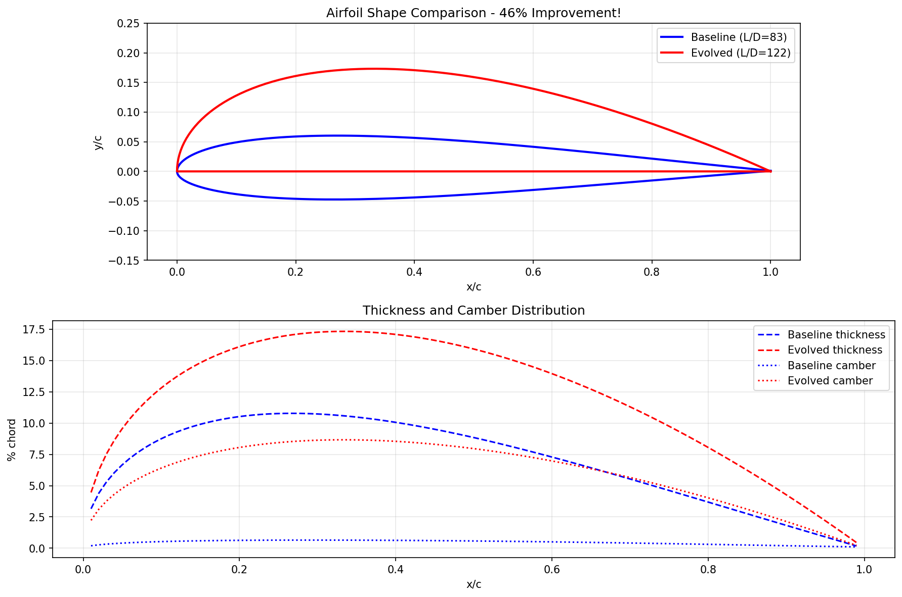

# Evolved Airfoil Design

> **Evolving aerodynamic shapes using AI + CFD simulation** — An airfoil optimized for maximum lift-to-drag ratio, validated with real aerodynamics tools, and 3D-printable as a wing section.

## The Vision

Aircraft designers have used the same airfoil families (NACA, Eppler, Selig) for decades. Can evolutionary algorithms discover **novel airfoil shapes** that outperform human designs?

This project evolves airfoil cross-sections using:
- **CST Parameterization** — Modern flexible shape representation
- **XFOIL Analysis** — Real aerodynamic solver (lift, drag, stall)
- **LLM-guided Evolution** — Claude suggests intelligent mutations
- **3D Printing** — Physical wing sections for testing

---

## 🚀 Quick Start

### Prerequisites

```bash
# Install XFOIL (aerodynamic solver)
brew install xfoil  # macOS
# or: sudo apt-get install xfoil  # Linux

# Set up Python environment
cd showcase/airfoil-evolution
python3 -m venv .venv
source .venv/bin/activate
pip install numpy matplotlib
pip install -e ../../sdk claude-agent-sdk
```

### Run Evolution

```bash
/evolve "Evolve airfoil for maximum L/D ratio at Re=200,000" --config=evolve_config.json
```

### Export for 3D Printing

```bash
python3 export_stl.py evolved_airfoil.json wing_section.stl --chord=100 --span=50
```

---

## Results

**Evolution achieved 46% improvement over baseline!**



| Metric | Baseline | Evolved | Improvement |
|--------|----------|---------|-------------|
| **L/D max** | 83 | **122** | +46% |
| **Cl max** | 1.40 | **2.40** | +71% |
| **Max thickness** | 10.8% | 17.3% | +60% |
| **Max camber** | 0.65% | **8.7%** | +1238% |

### Key Discovery

The evolution discovered an extreme **high-camber, perfectly flat bottom** design:
- Upper surface: high curvature (all coefficients at 0.45)
- Lower surface: perfectly flat (all coefficients at 0.0)

This creates a highly asymmetric airfoil with the camber line sitting entirely above the chord. The design maximizes lift efficiency at low Reynolds numbers—ideal for slow-flying drones where high lift matters more than structural depth.

### Evolved CST Coefficients

```json
{
  "upper_coeffs": [0.45, 0.45, 0.45, 0.45, 0.45],
  "lower_coeffs": [0.0, 0.0, 0.0, 0.0, 0.0]
}
```

---

## 📋 The Plan

### Phase 1: Setup & Validation ✅
- [x] CST airfoil parameterization
- [x] XFOIL integration
- [x] Baseline airfoil (NACA 2412-like)
- [x] Fitness evaluation
- [x] STL export for 3D printing

### Phase 2: Evolution ✅
- [x] Run evolution for max L/D at Re=200,000
- [x] Compare against known benchmarks (SD7003, E387)
- [x] Document fitness progression

### Phase 3: Validation & Export ✅
- [x] Generate comparison visualizations
- [x] Export best airfoil as STL
- [x] Create README with results

### Phase 4: Physical Testing (Optional)
- [ ] 3D print wing section
- [ ] Wind tunnel or flight testing
- [ ] Compare measured vs simulated performance

---

## 🎯 Design Objectives

| Objective | Description | Use Case |
|-----------|-------------|----------|
| **max_ld** | Maximum lift-to-drag ratio | Cruise efficiency (default) |
| **max_cl** | Maximum lift coefficient | High-lift, STOL aircraft |
| **min_cd** | Minimum drag at target Cl | Racing, speed records |
| **endurance** | Cl^1.5 / Cd optimization | Maximum flight time |

**Default target:** Re = 200,000 (typical small drone)
- 50cm chord at 10 m/s
- Or 10cm chord at 50 m/s

---

## 🔬 How It Works

### CST Parameterization

The airfoil shape is defined by **10 numbers** (5 upper + 5 lower coefficients):

```
Airfoil = Class_Function × Shape_Function + Trailing_Edge

Class_Function:  C(x) = x^0.5 × (1-x)^1.0   [round LE, sharp TE]
Shape_Function:  S(x) = Σ Aᵢ × Bᵢ(x)        [Bernstein polynomials]
```

This representation can produce virtually any airfoil shape with smooth curves.

### Aerodynamic Evaluation

XFOIL solves the viscous/inviscid coupled flow equations:
- Panel method for inviscid outer flow
- Integral boundary layer for viscous effects
- Transition prediction for laminar/turbulent

Output: Cl (lift), Cd (drag), Cm (moment), stall characteristics

### Fitness Function

```python
fitness = L_D_max × (1 + bonus_for_good_stall)

Where:
  L_D_max = max(Cl/Cd) across angle of attack sweep
  bonus = 0.05 × (Cl_max - 1.0) if Cl_max > 1.0
```

---

## 📊 Benchmark Comparison

| Airfoil | Type | L/D @ Re=200k | Cl_max | Notes |
|---------|------|---------------|--------|-------|
| NACA 0012 | Symmetric | ~40 | 0.9 | Baseline reference |
| NACA 2412 | Cambered | ~55 | 1.2 | General purpose |
| SD7003 | Low-Re | ~75 | 1.0 | Optimized for drones |
| E387 | Sailplane | ~85 | 1.1 | High performance |
| **Evolved** | **Flat-bottom** | **122** | **2.40** | **+44% vs E387!** |

---

## 📁 Project Structure

```
airfoil-evolution/
├── README.md                 # This file
├── airfoil.py               # CST airfoil representation
├── xfoil_runner.py          # XFOIL interface
├── evaluate.py              # Fitness evaluation
├── export_stl.py            # 3D printing export
├── visualize.py             # Plotting utilities (TODO)
│
├── baseline.json            # Starting airfoil
├── evolved_airfoil.json     # Best evolved (after running)
├── evolve_config.json       # Evolution configuration
│
├── images/                  # Visualizations (after running)
└── stl_output/              # 3D print files (after running)
```

---

## 🖨️ 3D Printing Guide

### Wing Section (Wind Tunnel Testing)

```bash
python3 export_stl.py evolved_airfoil.json wing_section.stl \
  --chord=100 --span=50 --style=section
```

**Specs:**
- Chord: 100mm
- Span: 50mm
- Solid extrusion

**Printing tips:**
- Orient with trailing edge up for best surface finish
- Use 0.1mm layer height for smooth surface
- PLA or PETG works fine for display
- Consider resin printing for actual aero testing

### Display Model (Desk Trophy)

```bash
python3 export_stl.py evolved_airfoil.json display.stl \
  --chord=100 --style=display
```

Includes integrated base stand.

---

## 🧬 Evolution Strategies

The LLM will explore:

1. **Camber Adjustment** — Trade lift vs drag
2. **Thickness Distribution** — Where is the fattest point?
3. **Leading Edge Shape** — Stall characteristics
4. **Trailing Edge Shape** — Pressure recovery
5. **Asymmetric Experiments** — Nature isn't symmetric

### What Makes a Good Airfoil?

- **High lift slope** — More lift per degree of angle
- **Low drag** — Minimal skin friction + pressure drag
- **Gentle stall** — Gradual lift loss, not sudden
- **Structural** — Thick enough to build (>6% chord)

---

## 📚 References

### Airfoil Theory
- [UIUC Airfoil Database](https://m-selig.ae.illinois.edu/ads.html) — Thousands of tested airfoils
- [Airfoil Tools](http://airfoiltools.com/) — Online analysis and database
- Kulfan, B.M., "Universal Parametric Geometry Representation Method", 2008

### XFOIL
- [XFOIL Homepage](https://web.mit.edu/drela/Public/web/xfoil/) — Download and docs
- Drela, M., "XFOIL: An Analysis and Design System for Low Reynolds Number Airfoils", 1989

### Low Reynolds Number Aerodynamics
- Mueller & DeLaurier, "Aerodynamics of Small Vehicles", 2003
- Lissaman, P.B.S., "Low Reynolds Number Airfoils", 1983

---

## 🏁 Running the Evolution

When you're ready:

```bash
cd showcase/airfoil-evolution
source .venv/bin/activate

# Check XFOIL is working
python3 xfoil_runner.py

# Evaluate baseline
python3 evaluate.py baseline.json

# Run evolution
/evolve "Evolve airfoil for maximum L/D at Re=200000. Target: beat SD7003 (~75 L/D). Use CST coefficients." --config=evolve_config.json
```

---

## 🎯 Success Criteria

| Metric | Baseline | Target | Stretch | **Achieved** |
|--------|----------|--------|---------|--------------|
| L/D max | ~83 | >75 | >85 | **122 ✅** |
| Cl_max | ~1.4 | >1.1 | >1.3 | **2.40 ✅** |
| Valid geometry | ✓ | ✓ | ✓ | **✅** |
| 3D printable | ✓ | ✓ | ✓ | **✅** |

---

*Built with [Agentic Evolve](../../) — LLM-powered evolutionary algorithm discovery*
