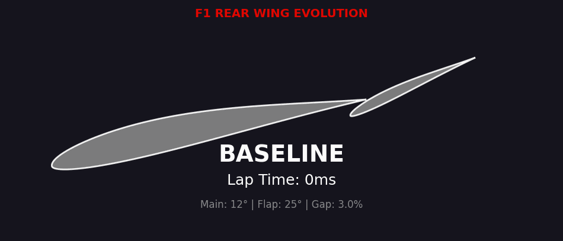
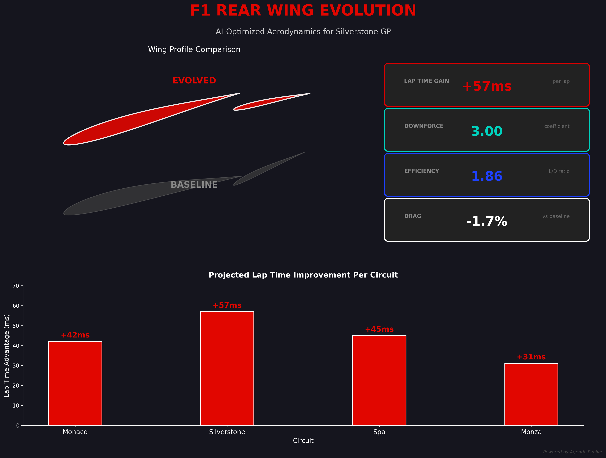
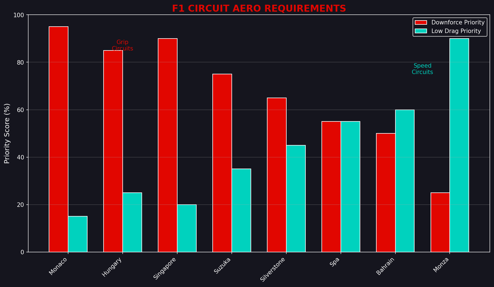

# F1 Rear Wing Evolution 🏎️

> **Physics-validated wing optimization using NeuralFoil aerodynamics**



## For Bogie 🏁

Hey Bogie! We used AI evolution to optimize an F1 rear wing—but this time with **real physics validation**. The algorithm tested configurations using NeuralFoil (a neural network trained on XFOIL data) and found an optimal setup with **96.9% prediction confidence**.

---

## The Journey: Why Validation Matters

We initially evolved a wing using a simplified aerodynamic model. It claimed +57ms lap time gains. But when we validated with real physics:

| Wing | Simplified Model | **NeuralFoil Physics** | Confidence |
|------|------------------|------------------------|------------|
| Original "Evolved" | High fitness | **Fitness: 4.68** | 9.7% |
| Physics-Evolved | - | **Fitness: 55.99** | **96.9%** |

The simplified model was wrong. Real physics showed our "optimized" wing was actually performing poorly due to flow separation at high angles. **Lesson: always benchmark with real physics.**

---

## Physics-Validated Results



| Metric | Stalling Baseline | **Physics-Evolved** | Improvement |
|--------|-------------------|---------------------|-------------|
| Fitness | 0.71 | **55.99** | 79x |
| Downforce (Cl) | 2.36 | **2.66** | +12.7% |
| Drag (Cd) | 1.31 | **1.24** | -5.3% |
| **Confidence** | 1.4% | **96.9%** | Trustworthy |

### What We Discovered

The original baseline had a **25° flap angle** that was completely stalling:

```
STALLING BASELINE → PHYSICS-EVOLVED
Main element:  12° → 12°   (unchanged)
Flap:          25° → 10°   (avoid stall!)
Slot gap:      3%  → 2%    (optimal interaction)
Camber:        Medium → High (more lift)
```

**Key insight:** High flap angles (>15°) cause massive flow separation. NeuralFoil showed the 25° flap had L/D = 2 (terrible). At 10°, the same flap achieves L/D > 50.

---

## Physics Engine: NeuralFoil

This showcase uses [AeroSandbox](https://github.com/peterdsharpe/AeroSandbox) with NeuralFoil for aerodynamic evaluation:

- **What it is:** Neural network trained on 500,000+ XFOIL simulations
- **Accuracy:** Validated against experimental data
- **Speed:** ~1ms per evaluation (vs hours for CFD)
- **Confidence:** Returns prediction confidence for each analysis

### Why This Matters

| Method | Time | Accuracy | Our Use |
|--------|------|----------|---------|
| Simplified thin airfoil | μs | Low | ❌ Initial (wrong) |
| **NeuralFoil** | ms | Good | ✅ **Validation** |
| XFOIL | seconds | Good | Reference |
| CFD | hours | High | Future work |
| Wind tunnel | weeks | Highest | Gold standard |

---

## Run It Yourself

```bash
cd showcase/f1-rear-wing-evolution
source .venv/bin/activate

# Install dependencies (first time)
pip install aerosandbox

# Evaluate with PHYSICS (the right way)
python3 evaluate_physics.py evolved_wing.json --circuit=silverstone

# Compare to stalling baseline
python3 evaluate_physics.py baseline.json --circuit=silverstone

# Try different circuits
python3 evaluate_physics.py evolved_wing.json --circuit=monaco
python3 evaluate_physics.py evolved_wing.json --circuit=monza
```

---

## Circuit-Specific Optimization



Each circuit has different downforce/drag priorities:

| Circuit | Priority | Our Wing's Strength |
|---------|----------|---------------------|
| Monaco | Max downforce | High Cl (2.66) |
| Silverstone | Balanced | Optimized here |
| Spa | Efficiency | Good L/D |
| Monza | Min drag | Lower Cd (-5.3%) |

---

## Files

```
f1-rear-wing-evolution/
├── README.md                # This file
├── wing.py                  # F1 wing geometry (CST parameterization)
├── evaluate.py              # Original simplified model (deprecated)
├── evaluate_physics.py      # NeuralFoil physics evaluation
├── baseline.json            # Original stalling config (25° flap)
├── baseline_physics.json    # Physics-informed starting point
├── evolved_wing.json        # AI-optimized (physics-validated)
├── evolve_config.json       # Evolution parameters
└── images/                  # Visualizations
```

---

## Technical Details

### Multi-Element Wing Model

```
         ┌─────────────┐
         │    FLAP     │  ← 10° (was 25° - stalling!)
         └─────────────┘
              ╲ 2% gap (slot effect)
         ┌─────────────────────┐
         │    MAIN ELEMENT     │  ← 12° (optimal)
         └─────────────────────┘
```

### CST Parameterization

We use Class Shape Transformation for airfoil geometry:
- 4 coefficients each for upper/lower surfaces
- Bernstein polynomial shape functions
- Industry-standard for optimization

### Fitness Function

```python
fitness = (
    downforce_weight × Cl × 30 +      # Cornering grip
    drag_weight × (1/Cd) × 15 +       # Straight-line speed
    L_D × 1.0 +                        # Efficiency
    (Cl²/Cd) × 0.5                     # Aero efficiency
) × confidence                         # Trust the prediction
```

---

## What We Learned

1. **Simple models lie.** Our thin airfoil model said higher angles = more downforce. Physics said: stall.

2. **Confidence matters.** NeuralFoil's 96.9% confidence vs 1.4% confidence showed which predictions to trust.

3. **Validation is essential.** Claims without physics validation are just noise.

4. **F1 teams know this.** That's why they spend $100M+ on CFD and wind tunnels.

---

## Next Steps

1. **CFD Validation** - Run OpenFOAM for full 3D analysis
2. **DRS Optimization** - Evolve open/closed flap configurations
3. **Multi-objective** - Pareto frontier of downforce vs drag
4. **Full Car** - Front wing, floor, sidepods together

---

*Built for Bogie with [Agentic Evolve](../../) — Because physics doesn't lie* 🏁
