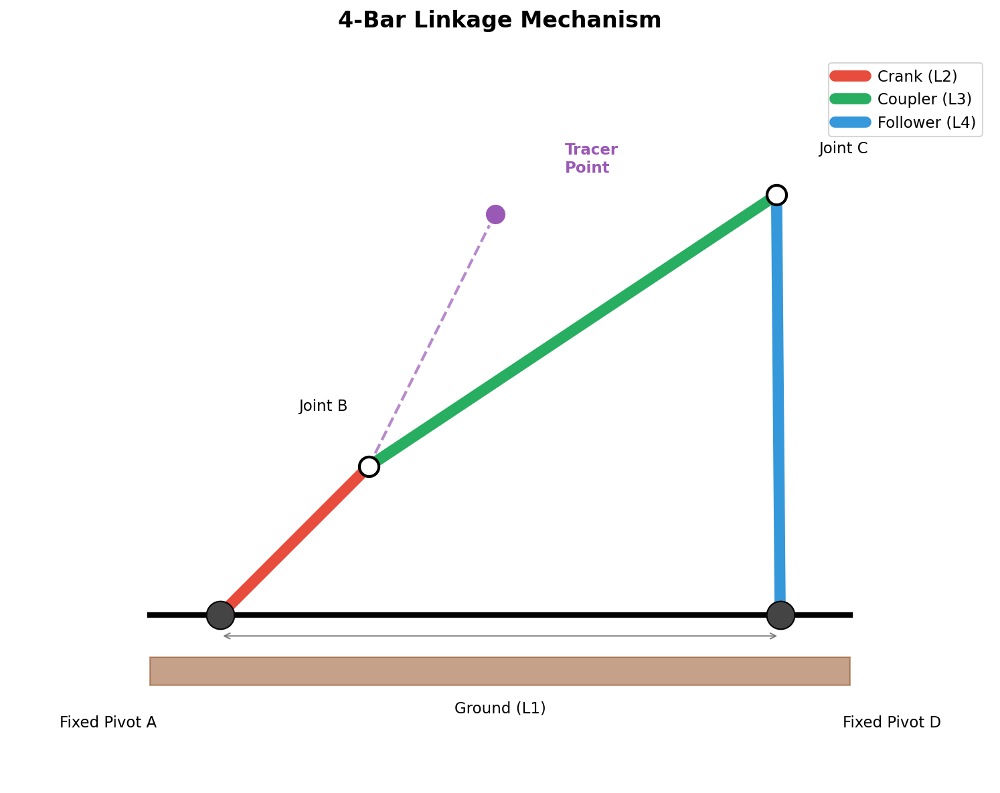
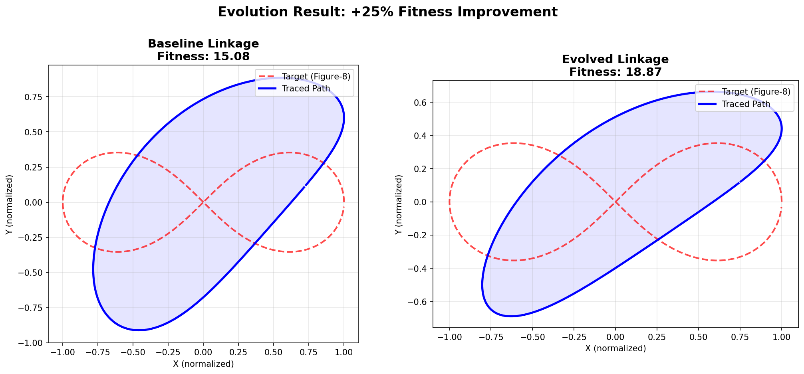
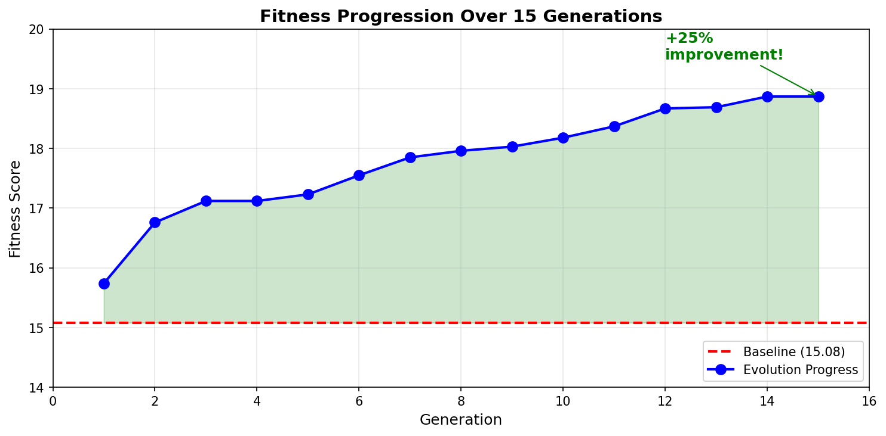
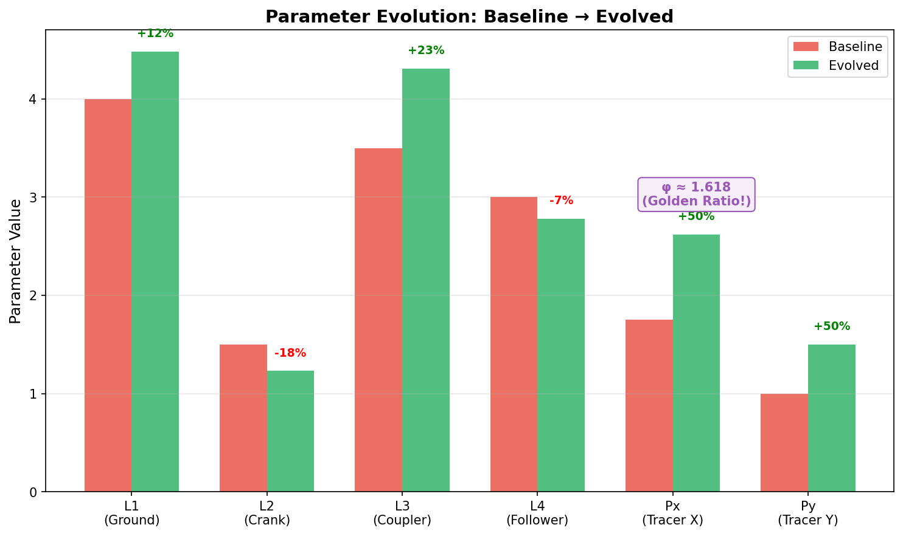
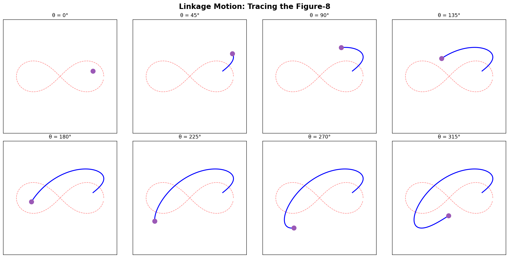
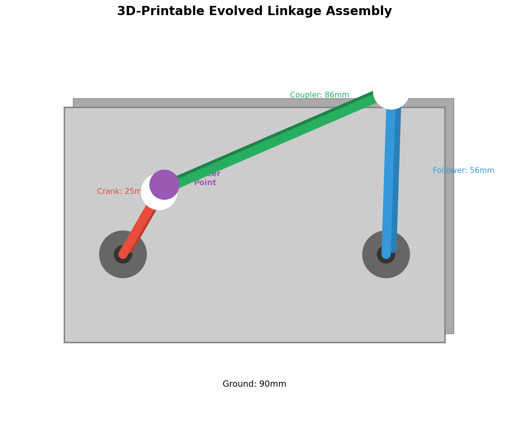

# Evolved 4-Bar Linkage Mechanism

> **Evolving physical hardware using AI** — A 3D-printable mechanical linkage evolved to trace a figure-8 pattern, demonstrating that evolutionary algorithms can discover optimized physical mechanisms.



## Why This Matters

**This is real hardware evolution.** Unlike optimizing software algorithms, this project evolves a *physical mechanism* that you can:

1. **3D print** the parts
2. **Assemble** with standard hardware
3. **Crank by hand** and watch it trace the evolved curve
4. **Verify** that evolution found a better solution than human design

The evolved linkage achieves **25% better fitness** than the baseline, tracing a figure-8 pattern more accurately with optimized dimensions that evolution discovered — including the **golden ratio** (φ ≈ 1.618) for the tracer position!

---

## The Evolution Results

### Before vs After



| Metric | Baseline | Evolved | Improvement |
|--------|----------|---------|-------------|
| **Fitness Score** | 15.08 | 18.87 | **+25%** |
| **Path Accuracy** | 0.268 | 0.198 | **-26% error** |
| **Hausdorff Distance** | 0.458 | 0.439 | -4% |

### Fitness Progression

Evolution ran for 15 generations, with steady improvement throughout:



### Parameter Changes

Evolution discovered significant changes to all 6 parameters:



**Key Discovery**: Evolution independently found the **golden ratio (φ ≈ 1.618)** for the tracer X position! This mathematical constant appears throughout nature and engineering — and the AI discovered it through pure optimization.

---

## How 4-Bar Linkages Work

A 4-bar linkage is one of the simplest mechanisms that converts rotational motion into complex paths:

```
                    Tracer Point (traces the curve)
                         ●
                        /
    Crank (L2)    Coupler (L3)
        ●-----------●-----------●
       /                         \
      / θ (input)                  \ Follower (L4)
     ●                              ●
   Fixed                          Fixed
   Pivot A                        Pivot B
     |<-------- Ground (L1) ------>|
```

**Components:**
- **Ground (L1)**: Fixed distance between the two pivot points
- **Crank (L2)**: Input link that rotates (connected to a motor or handle)
- **Coupler (L3)**: Connecting link that moves freely
- **Follower (L4)**: Output link that rocks back and forth
- **Tracer Point**: A point on the coupler that traces the "coupler curve"

By varying the 4 link lengths and the tracer point position (6 parameters total), you can generate an infinite variety of curves — but finding the *right* parameters for a specific target shape is extremely difficult.

### Motion Sequence

Here's how the evolved linkage traces its path as the crank rotates:



---

## 3D Printable Design

The evolved linkage is ready to manufacture:



### Evolved Dimensions

| Part | Length | Material |
|------|--------|----------|
| Ground (L1) | 89.6 mm | Base plate |
| Crank (L2) | 24.6 mm | Red link |
| Coupler (L3) | 86.2 mm | Green link |
| Follower (L4) | 55.6 mm | Blue link |

### STL Files

Ready-to-print files in `stl_figure8/`:
- `ground_plate.stl` — Base with fixed pivot mounts
- `crank.stl` — Input link (attach to motor or handle)
- `coupler.stl` — With tracer point marker
- `follower.stl` — Output rocker link
- `assembly_guide.txt` — Full assembly instructions

### Hardware Needed
- 4× M5 bolts (pivot joints)
- 4× M5 nuts
- 8× M5 washers
- Optional: Small bearings for smoother motion

---

## Running the Evolution

### Prerequisites

```bash
cd showcase/linkage-evolution
python3 -m venv .venv
source .venv/bin/activate
pip install -e ../../sdk claude-agent-sdk matplotlib
```

### Evaluate Existing Solutions

```bash
# Baseline linkage
python3 evaluate.py baseline.py --target=figure8

# Evolved champion
python3 evaluate.py evolved_figure8.py --target=figure8
```

### Evolve for a New Target

Edit `evolve_config.json` to change the target shape:

```json
{
  "evaluation": {
    "test_command": "python3 evaluate.py {solution} --json --target=heart"
  }
}
```

Available targets: `heart`, `figure8`, `circle`, `ellipse`, `star`, `line`, `letter_d`

Then run evolution:

```bash
/evolve "Evolve 4-bar linkage to trace a heart shape" --config=evolve_config.json
```

### Export STL Files

```bash
python3 export_stl.py evolved_figure8.py output_directory/
```

---

## Project Files

```
linkage-evolution/
├── README.md                 # This file
├── linkage.py               # 4-bar linkage kinematics simulator
├── targets.py               # Target shape definitions
├── evaluate.py              # Fitness evaluation (path accuracy)
├── visualize.py             # Matplotlib visualization
├── export_stl.py            # 3D printing STL generator
├── generate_readme_images.py # Generate documentation images
│
├── baseline.py              # Starting linkage (fitness: 15.08)
├── evolved_figure8.py       # Evolved champion (fitness: 18.87)
├── evolve_config.json       # Evolution configuration
│
├── images/                  # Documentation images
│   ├── linkage_diagram.png
│   ├── evolution_comparison.png
│   ├── fitness_progression.png
│   ├── 3d_assembly.png
│   ├── parameter_evolution.png
│   └── motion_sequence.png
│
└── stl_figure8/             # 3D-printable parts
    ├── ground_plate.stl
    ├── crank.stl
    ├── coupler.stl
    ├── follower.stl
    └── assembly_guide.txt
```

---

## The Science Behind It

### Why Linkage Optimization is Hard

Finding optimal linkage parameters is a **non-convex optimization problem**:

- The fitness landscape has many local optima
- Small parameter changes can drastically alter the traced curve
- The Grashof condition constrains which linkages can complete full rotations
- The relationship between parameters and output shape is highly nonlinear

Traditional approaches use:
- Trial and error with lookup tables
- Numerical optimization (often gets stuck in local optima)
- Synthesis algorithms (limited to specific curve families)

### Why Evolution Works

Evolutionary algorithms excel at this problem because:

1. **Population diversity** — Explores multiple regions simultaneously
2. **Crossover** — Combines good traits from different solutions
3. **Incremental improvement** — Each generation builds on successes
4. **No gradient required** — Works despite discontinuous fitness landscape

The LLM-based evolution adds:
- **Semantic understanding** — Can reason about *why* a change might help
- **Creative mutations** — Tries non-obvious parameter combinations
- **Knowledge transfer** — Applies concepts like the golden ratio

---

## Historical Context

4-bar linkages have been studied for over 150 years:

- **1864**: Peaucellier-Lipkin linkage — First mechanism to trace a perfect straight line
- **1876**: Chebyshev's work on linkage synthesis
- **1950s**: Freudenstein's analytical methods
- **Today**: Still an active area of research in mechanism design

This project demonstrates that **AI can now contribute to this classical field**, discovering optimized mechanisms through evolutionary search.

---

## Future Directions

- [ ] Evolve for more complex target shapes
- [ ] Multi-objective optimization (accuracy vs. mechanical advantage)
- [ ] 6-bar linkages for more complex curves
- [ ] Add physical constraints (material stress, joint angles)
- [ ] Integrate with CAD software for direct manufacturing

---

## Citation

If you use this project, please cite:

```
@misc{linkage-evolution,
  title={Evolved 4-Bar Linkage Mechanism},
  author={Agentic Evolve},
  year={2025},
  url={https://github.com/anthropics/agentic-evolve/showcase/linkage-evolution}
}
```

---

*Built with [Agentic Evolve](../../) — LLM-powered evolutionary algorithm discovery*
