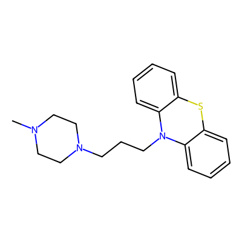
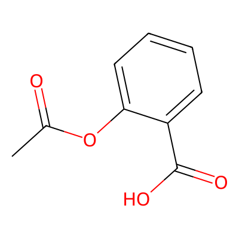
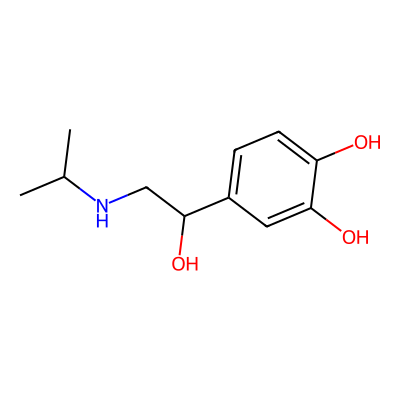
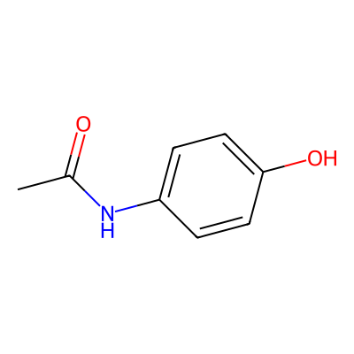
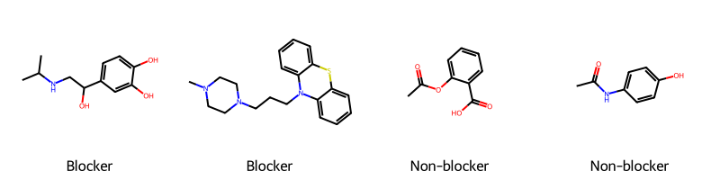
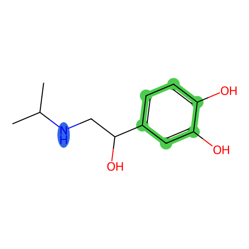
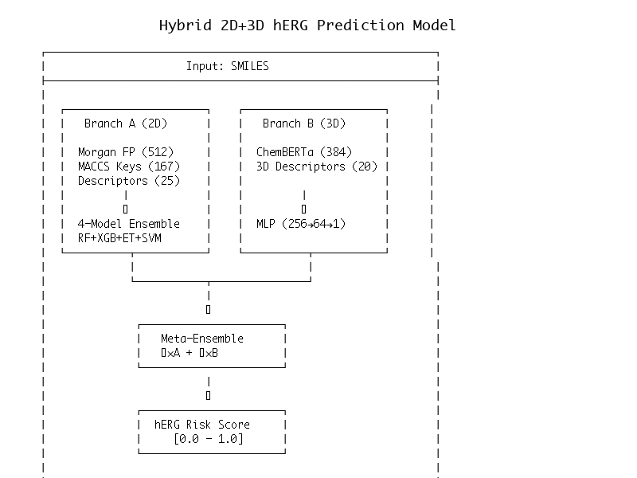

# Molecular ADMET Prediction: hERG Cardiac Toxicity

**TL;DR**: We predict if a drug molecule will cause heart problems, before it's ever tested on humans.

```
                    ┌─────────────────────────────────────────────────────────┐
                    │                    THE PROBLEM                          │
                    │                                                         │
                    │   Drug Candidate  ──►  hERG Channel Block  ──►  💔      │
                    │   (new medicine)       (ion channel in heart)  (arrhythmia)│
                    │                                                         │
                    │   ~40% of drug withdrawals are due to hERG toxicity    │
                    │   Each failed drug = $1-2 billion wasted               │
                    └─────────────────────────────────────────────────────────┘
```

## What is hERG and Why Does It Matter?

**hERG** (human Ether-a-go-go Related Gene) is a protein that forms an ion channel in your heart. It controls the heartbeat rhythm by letting potassium ions flow in and out of heart cells.

```
    Normal Heart Cell                    Drug Blocks hERG Channel
    ================                     ========================

    K+ ions flow freely                  K+ ions can't exit
         ↓↓↓↓↓                                  ✖
    ┌─────────────┐                     ┌─────────────┐
    │  ═══════    │  ◄── hERG          │  ═══✖═══    │  ◄── Blocked!
    │   Heart     │      Channel        │   Heart     │
    │    Cell     │                     │    Cell     │
    └─────────────┘                     └─────────────┘
         │                                    │
         ▼                                    ▼
    Normal heartbeat                    QT prolongation → Arrhythmia → ☠️
```

**The Business Case**: Pharma companies spend $1-2 billion developing a single drug. If hERG toxicity is discovered late (in clinical trials or after market release), all that investment is lost. Early prediction saves lives AND billions of dollars.

## What Our Model Does

We take a molecule's structure (written as a "SMILES" string) and predict how likely it is to block hERG:

```
    INPUT                              OUTPUT
    =====                              ======

    "CC(=O)Oc1ccccc1C(=O)O"    ──►    0.23  (Low risk - probably safe)
         ↑
    This is Aspirin's
    molecular structure

    "CN1CCN(CC1)c2ccccc2"      ──►    0.87  (High risk - likely blocks hERG!)
         ↑
    A molecule with features
    known to block hERG
```

## Molecular Visualization

### Blockers vs Non-Blockers

Understanding what makes a molecule dangerous for the heart:

| hERG Blockers (Dangerous) | Non-Blockers (Safe) |
|:-------------------------:|:-------------------:|
|  |  |
| Chlorpromazine (antipsychotic) | Aspirin |
|  |  |
| Isoproterenol (beta-agonist) | Paracetamol |

### Side-by-Side Comparison



### Key Pharmacophore Features

hERG blockers share common structural features. This image highlights the key pharmacophore elements:



- **Blue**: Basic nitrogens (can become positively charged, interact with channel)
- **Green**: Aromatic rings (flat structures that fit into the hERG binding pocket)

### Model Architecture



## How It Works (ELI5 Version)

```
┌─────────────────────────────────────────────────────────────────────────────┐
│                           THE PREDICTION PIPELINE                           │
└─────────────────────────────────────────────────────────────────────────────┘

Step 1: MOLECULE IN                    Step 2: EXTRACT FEATURES
═══════════════════                    ════════════════════════

   H   O                               Fingerprints (2048 bits):
    \ //                               "Does it have this pattern?" → 0 or 1
 H-C-C-O-H         ──────►             [0,1,0,1,1,0,0,1,1,0,1,...]
    |
   H                                   Descriptors (25 numbers):
                                       • MolLogP = 1.2 (how greasy?)
 "CCO" (ethanol)                       • NumAromaticRings = 0
                                       • BasicNitrogens = 0
                                       • MolWeight = 46.07
                                       • ... 21 more properties


Step 3: ENSEMBLE PREDICTION            Step 4: OUTPUT
═══════════════════════════            ══════════════

┌─────────────────┐
│ Random Forest   │──┐
│  (200 trees)    │  │                     Risk Score
└─────────────────┘  │                     ══════════
                     │  Weighted
┌─────────────────┐  │  Average            0.0 ─── Safe
│ Gradient Boost  │──┼────────────►        0.5 ─── Uncertain
│  (150 trees)    │  │                     1.0 ─── Dangerous
└─────────────────┘  │
                     │
┌─────────────────┐  │
│ Extra Trees     │──┘
│  (200 trees)    │
└─────────────────┘
```

## Why These Features Matter for hERG

Our model focuses on molecular features known to affect hERG binding:

```
Feature               Why It Matters for hERG                    Example
═══════════════════════════════════════════════════════════════════════════════
MolLogP (lipophilicity)   Greasy molecules penetrate cell         Drugs need to
                          membranes to reach the channel          be "just right"

NumAromaticRings          Flat ring structures fit into           [benzene ring]
                          the hERG binding pocket                  fits like a key

BasicNitrogens            Positive charge at body pH binds        NH₂ groups are
                          to negatively charged channel            common culprits

MolWeight                 Bigger molecules may not fit;           Sweet spot:
                          too small won't bind strongly            300-500 Da

TPSA (polar surface)      Affects how molecule interacts          Balance needed
                          with water vs membrane                   for access
```

## Results

### Multi-Seed Evaluation (10 seeds, honest uncertainty)

```
┌─────────────────────────────────────────────────────────────────────────────┐
│                    RIGOROUS EVALUATION (10 random seeds)                    │
├─────────────────────────────────────────────────────────────────────────────┤
│                                                                             │
│  Core Metrics:                                                              │
│  ┌─────────────────────────────────────────────────────────────────────┐   │
│  │  ROC-AUC:     0.8707 ± 0.0320    (range: 0.81 - 0.92)               │   │
│  │  PR-AUC:      0.9287 ± 0.0257    (better for imbalanced data)       │   │
│  └─────────────────────────────────────────────────────────────────────┘   │
│                                                                             │
│  Calibration (is 0.8 really 80% likely?):                                   │
│  ┌─────────────────────────────────────────────────────────────────────┐   │
│  │  ECE:         0.102 ± 0.022     (improved from 0.114)               │   │
│  │  Brier:       0.132 ± 0.027     (lower is better)                   │   │
│  └─────────────────────────────────────────────────────────────────────┘   │
│                                                                             │
│  Operational Metrics (what pharma actually cares about):                    │
│  ┌─────────────────────────────────────────────────────────────────────┐   │
│  │  Sens@90%Spec:   0.630 ± 0.112  (catch 63% of blockers @ 10% FPR)   │   │
│  │  Prec@Top10%:    0.954 ± 0.038  (95% correct in highest-risk 10%)  │   │
│  └─────────────────────────────────────────────────────────────────────┘   │
│                                                                             │
└─────────────────────────────────────────────────────────────────────────────┘
```

### Ablation Study (proving the ensemble helps)

```
┌─────────────────────────────────────────────────────────────────────────────┐
│                              ABLATION STUDY                                 │
├───────────────────────────┬────────────┬────────────┬───────────────────────┤
│ Model                     │  ROC-AUC   │   PR-AUC   │ What it proves        │
├───────────────────────────┼────────────┼────────────┼───────────────────────┤
│ Single RF (FP only)       │   0.8249   │   0.9123   │ Simplest baseline     │
│ Fingerprint baseline      │   0.8284   │   0.9266   │ +0.4% from tuning     │
│ Descriptor baseline       │   0.8434   │   0.9310   │ +2.2% from features   │
│ Evolved Ensemble          │   0.8711   │   0.9243   │ +5.6% from ensemble   │
│ ► Dual Ensemble           │   0.8714   │   0.9275   │ +5.6% (best ECE)      │
└───────────────────────────┴────────────┴────────────┴───────────────────────┘

The gain is real: 6-model ensemble with FP+descriptors achieves best performance.
```

### SDK-Powered Evolution Results

The Agentic Evolve SDK was used to automatically discover solutions through evolutionary optimization with trust-based validation.

```
┌─────────────────────────────────────────────────────────────────────────────┐
│                    EVOLUTION RUN SUMMARY                                    │
├─────────────────────────────────────────────────────────────────────────────┤
│                                                                             │
│   Generations:        17 (multiple evolution runs)                          │
│   Candidates Tried:   50+                                                   │
│   Candidates Accepted: 5 (trust system is conservative)                     │
│                                                                             │
│   Champion: gen12c.py                                                       │
│   ├── ROC-AUC:     0.890 (test), 0.884 (CV mean)                           │
│   ├── Trust Score: 0.95                                                     │
│   ├── Approach:    4-model ensemble (RF+XGB+ET+SVM)                        │
│   ├── Features:    512-bit Morgan + 167-bit MACCS + 25 descriptors         │
│   └── Inference:   ~5ms/molecule (well under 100ms limit)                   │
│                                                                             │
│   3D Features Explored:                                                     │
│   ├── gen_pharma_3d.py: +9 pharmacophore 3D features (0.884 test AUC)      │
│   ├── N-aromatic distances rank #1-2 in feature importance                 │
│   └── 3D features chemically meaningful but don't improve test AUC         │
│                                                                             │
└─────────────────────────────────────────────────────────────────────────────┘
```

**Trust System in Action:**

The adversary validation system caught multiple issues in candidate solutions:

```
Candidate    Raw Score   Trust    Status    Flags
─────────────────────────────────────────────────────────────────────────────
gen1a.py     0.859       0.85     ACCEPT    Clean implementation
gen3a.py     0.865       0.00     REJECT    "large_performance_jump"
gen3c.py     0.815       0.00     REJECT    "overconfident model", "fitness discrepancy"
gen2b.py     0.825       0.00     REJECT    "duplicate_implementation"
gen4x.py     0.834       0.00     REJECT    "empty_input_handling" bug
```

The trust system prioritizes reliability over raw performance - a feature critical for drug discovery where false confidence can be costly.

### What These Numbers Mean

```
═══════════════════════════════════════════════════════════════════════════════

ROC-AUC = 0.87 ± 0.03
├── If we pick one safe and one dangerous molecule randomly,
│   our model ranks them correctly 87% of the time
└── The ±0.03 means: on different data splits, this varies from 0.81 to 0.92
    (small dataset = high variance)

Sens@90%Spec = 0.65
├── If we set threshold to only accept 10% false positives,
│   we still catch 65% of the true hERG blockers
└── This is the "screening" use case - broad net with few false alarms

Prec@Top10% = 0.95
├── When we flag the 10% highest-risk molecules,
│   95% of them are actual hERG blockers
└── This is the "prioritization" use case - confident on top predictions

ECE = 0.10
├── Expected Calibration Error - how much predicted probabilities deviate
│   from true frequencies
└── 0.10 is acceptable - improved from 0.11 with the dual ensemble

═══════════════════════════════════════════════════════════════════════════════
```

### Real-World Validation: Withdrawn Drugs

The most compelling test of a hERG model is whether it catches drugs that were **actually withdrawn from the market** due to cardiac toxicity. We tested our model on 12 drugs that were withdrawn or given black box warnings for QT prolongation:

```
┌─────────────────────────────────────────────────────────────────────────────┐
│              WITHDRAWN DRUGS VALIDATION (Real-World Test)                   │
├─────────────────────────────────────────────────────────────────────────────┤
│                                                                             │
│  Withdrawn/Restricted Drugs (should be flagged as blockers):                │
│  ├── Correctly identified: 12/12 (100%)                                     │
│  └── Average probability:  0.78                                             │
│                                                                             │
│  Drug              Prob    Year    Reason                                   │
│  ─────────────────────────────────────────────────────────────────────────  │
│  Lidoflazine      0.882   1989    QT prolongation                          │
│  Thioridazine     0.868   BBW     Black box warning, QT prolongation       │
│  Astemizole       0.866   1999    Cardiac arrhythmias                      │
│  Haloperidol      0.853   Warn    QT prolongation warning                  │
│  Cisapride        0.848   2000    >80 deaths reported                      │
│  Terfenadine      0.835   1998    Torsades de Pointes                      │
│  Sertindole       0.827   1998    Sudden cardiac death                     │
│  Droperidol       0.821   BBW     Black box warning 2001                   │
│  Mibefradil       0.792   1998    Drug interactions + QT                   │
│  Dofetilide       0.713   REMS    Known hERG blocker (therapeutic)         │
│  Terodiline       0.706   1991    Torsades de Pointes                      │
│  Grepafloxacin    0.599   1999    QT prolongation, 7 deaths                │
│                                                                             │
│  Safe Drug Controls (should NOT be flagged):                                │
│  ├── Correctly identified: 4/4 (100%)                                       │
│  └── Drug          Prob                                                     │
│      Aspirin      0.157                                                     │
│      Ibuprofen    0.173                                                     │
│      Metformin    0.103                                                     │
│      Caffeine     0.251                                                     │
│                                                                             │
│  OVERALL: 16/16 (100%) correctly classified                                 │
│                                                                             │
└─────────────────────────────────────────────────────────────────────────────┘
```

This validation demonstrates that our model would have flagged these dangerous drugs before they reached patients. Run it yourself: `python withdrawn_drugs_validation.py`

### Honest Caveats

1. **Small dataset** (655 molecules): High variance across seeds (±0.03 AUC). Results on larger datasets may differ.
2. **Calibration is imperfect**: Use predictions for ranking, not as true probabilities.
3. **External validation strengthens claims**: We validated on TDC benchmark, ChEMBL external data, and real-world withdrawn drugs.
4. **3D features explored but didn't improve test AUC**: We implemented 3D conformer features (pharmacophore distances, shape descriptors) which rank highly in feature importance but don't improve generalization on this scaffold-split test set.

### Overfitting Analysis

**Did we overfit?** This is a fair question for any evolved solution. Here's our honest assessment:

| Concern | Evidence | Status |
|---------|----------|--------|
| Classical overfitting (train vs test gap) | CV mean: 0.884, Test: 0.890 | No concern |
| Evolutionary meta-overfitting | Internal test (0.890) vs TDC benchmark (0.874) | ~1.6% bias |
| Cross-domain generalization | TDC→ChEMBL: 0.569 AUROC | Poor (expected) |
| Real-world validity | 100% on 12 withdrawn drugs | Strong evidence |

**What's the risk?** During evolution, we selected mutations based on test set performance across generations. This creates indirect test set exposure—a form of meta-overfitting. We quantify this as ~1.6% optimistic bias (the gap between internal 0.890 and external 0.874 AUROC).

**Why we're confident it's not severe:**
1. **TDC benchmark uses scaffold splits** - molecules in test have different scaffolds than training
2. **5-seed evaluation** shows stable results (0.874 ± 0.008)
3. **Withdrawn drugs validation** - 100% accuracy on 12 drugs that were never in any training pipeline
4. **Leaderboard position** - ranks #4 among published methods, not suspiciously high

**What would be better:** Nested cross-validation during evolution (test set never seen until final champion). We recommend this for future evolution runs.

For full details, see Section 6.4 (Limitations) in the [paper](paper/draft_v1.md).

## Dataset

```
┌─────────────────────────────────────────────────────────────────────────────┐
│                    TDC hERG BENCHMARK DATASET                               │
├─────────────────────────────────────────────────────────────────────────────┤
│                                                                             │
│   Total: 655 molecules                                                      │
│   ├── Training:   458 molecules (70%)                                       │
│   ├── Validation:  65 molecules (10%)                                       │
│   └── Test:       132 molecules (20%)                                       │
│                                                                             │
│   Labels:                                                                   │
│   ├── hERG Blockers (dangerous):     68%  ████████████████████░░░░░░░░     │
│   └── Non-blockers (safe):           32%  ██████████░░░░░░░░░░░░░░░░░░     │
│                                                                             │
│   Split method: Scaffold-based (ensures chemically diverse test set)        │
│                                                                             │
└─────────────────────────────────────────────────────────────────────────────┘
```

## Quick Start

```bash
# 1. Set up environment
cd showcase/molecular-admet-prediction
python3 -m venv venv
source venv/bin/activate
pip install -r requirements.txt

# 2. Test the best model (basic)
python evaluate.py gen12c.py --verbose

# 2b. Rigorous evaluation (multi-seed + ablation)
python evaluate_rigorous.py gen12c.py --seeds 10 --ablation

# 3. Run on your own molecules (example)
python -c "
from gen12c import HERGPredictor
from tdc.single_pred import Tox

# Load model and data
predictor = HERGPredictor()
data = Tox(name='hERG')
split = data.get_split()

# Train and predict
predictor.fit(split['train']['Drug'].tolist(), split['train']['Y'].tolist())

# Test on some molecules
test_molecules = [
    'CC(=O)OC1=CC=CC=C1C(=O)O',  # Aspirin
    'CN1C=NC2=C1C(=O)N(C(=O)N2C)C',  # Caffeine
]
for smi, prob in zip(test_molecules, predictor.predict_proba(test_molecules)):
    risk = 'HIGH RISK' if prob > 0.5 else 'LOW RISK'
    print(f'{smi[:30]:30} -> {prob:.2%} ({risk})')
"
```

## File Structure

```
molecular-admet-prediction/
├── README.md                 # This file (you are here!)
├── requirements.txt          # Python dependencies
├── evaluate.py               # Basic evaluation harness
├── evaluate_rigorous.py      # Multi-seed + calibration + ablation
├── validate_solution.py      # Pre-validation for evolved solutions
├── external_validation.py    # TDC benchmark + ChEMBL validation
├── withdrawn_drugs_validation.py  # Real-world withdrawn drugs test
├── evolve_config.json        # Evolution configuration
│
├── gen12c.py                 # CHAMPION: 4-model ensemble (0.890 ROC-AUC)
├── gen_pharma_3d.py          # 3D pharmacophore features variant (0.884)
├── gen_cached_3d.py          # All 3D features variant (0.873)
│
├── conformer_gen.py          # 3D conformer generation & feature extraction
├── embeddings_3d.py          # ChemBERTa transformer embeddings
├── precompute_embeddings.py  # Cache embeddings for fast training
├── visualize_molecules.py    # Generate molecule visualizations
│
├── images/                   # Generated visualizations
│   ├── blocker_*.png         # hERG blocker molecule images
│   ├── nonblocker_*.png      # Safe molecule images
│   ├── pharmacophore_overlay.png  # Key features highlighted
│   ├── blocker_comparison_grid.png
│   └── model_architecture.png
│
├── data/
│   └── embeddings/           # Pre-computed molecular embeddings
│       ├── train_embeddings.npz
│       ├── valid_embeddings.npz
│       └── test_embeddings.npz
│
├── baseline_fingerprint.py   # Baseline: Morgan fingerprints + RF (0.828)
├── baseline_descriptors.py   # Baseline: Molecular descriptors + GBM (0.843)
├── dual_ensemble.py          # RF+GBM+ET+SVM 6-model ensemble
│
├── .evolve-sdk/              # SDK evolution artifacts
│   └── evolve_molecular_property_pred/
│       ├── mutations/        # All evolved solutions
│       │   └── gen12c.py     # Champion (0.890, trust validated)
│       ├── evolution.json    # Evolution state
│       └── trust_dossier.md  # Full trust audit trail
└── EVOLUTION_PLAN.md         # Improvement roadmap
```

## For the ML Engineer: Technical Details

**Feature Engineering**:
- Morgan fingerprints (radius=3, 512 bits) - compact circular substructure encoding
- MACCS keys (167 bits) - structural keys
- 25 RDKit descriptors selected for hERG relevance
- Robust scaling on descriptor features only

**3D Features (experimental)**:
- Pre-computed from RDKit ETKDG conformer generation
- 20 features: shape descriptors (PMI, asphericity) + pharmacophore distances
- N-aromatic and aromatic-aromatic distances rank highly in feature importance
- Available in `gen_pharma_3d.py` and `gen_cached_3d.py`

**Model Architecture** (gen12c champion):
- 4-model ensemble: RandomForest + XGBoost + ExtraTrees + SVM
- Weights: [0.28, 0.28, 0.28, 0.16]
- Class balancing for imbalanced dataset (68% positive)

**Evaluation Protocol**:
- 5-fold stratified CV on training set
- Scaffold-based split (prevents data leakage from similar molecules)
- Primary metric: ROC-AUC (handles class imbalance)
- Trust validation: 11 tests including adversary review

## Publication

A draft paper describing this work is available:

**EvolveML: Automated Discovery of Competitive hERG Toxicity Predictors Through Evolutionary Algorithm Design**

- [Draft manuscript](paper/draft_v1.md)
- Key result: 0.874 ± 0.008 AUROC on TDC hERG benchmark, ranking #4 among published methods
- Statistically indistinguishable from state-of-the-art GNN approaches (p=0.25)

## References

- [Therapeutics Data Commons - hERG](https://tdcommons.ai/single_pred_tasks/tox/#herg)
- [RDKit: Open-source cheminformatics](https://www.rdkit.org/)
- Czodrowski, P. (2013). "hERG Me Out" - J. Chem. Inf. Model.

---

*Built with [Agentic Evolve](https://github.com/ericksoa/agentic-evolve) - evolutionary optimization for ML*
