# OpenML AutoML Benchmark Results

## Status: Setup Complete, Pilot Testing Pending

## How We Measure Success

Based on [AMLB 2023 benchmark](https://www.jmlr.org/papers/volume25/22-0493/22-0493.pdf) data:

| Framework | Avg Rank | Typical Improvement over XGB Default |
|-----------|----------|-------------------------------------|
| **AutoGluon** | 1.95 | +23% |
| LightAutoML | 4.78 | +17% |
| FLAML | 5.33 | +17% |
| Auto-sklearn 2 | 5.58 | +15% |
| XGBoost default | 8.86 | baseline |
| RandomForest default | 9.78 | -3% |

### Win Criteria

For each dataset, we calculate:
1. **Baseline F1**: Best of {LogReg, RF, XGB, LightGBM} with defaults
2. **Evolved F1**: Best evolved solution from evolve-sdk

**Claim levels:**
- **"Beats FLAML"**: Evolved F1 >= Baseline F1 * 1.17
- **"Beats Auto-sklearn"**: Evolved F1 >= Baseline F1 * 1.15
- **"Beats AutoGluon"**: Evolved F1 >= Baseline F1 * 1.23

Example: If XGBoost gets F1=0.60, we need F1>=0.70 to claim "beats FLAML".

### Rigorous Validation (Optional)

For publishable results, run AMLB directly:
```bash
pip install amlb
python -m amlb.run flaml openml/s/99 -m docker
```

---

## Pilot Results (5 datasets)

### Baseline Results (2025-01-08)

| Dataset | Samples | Classes | Imbalance | Best Model | Baseline F1 | Gap |
|---------|---------|---------|-----------|------------|-------------|-----|
| credit-g | 1000 | 2 | 2.33 | gradient_boosting | **0.846** | 0.126 |
| diabetes | 768 | 2 | 1.87 | random_forest | **0.648** | 0.229 |
| vehicle | 846 | 4 | 1.10 | logistic_regression | **0.793** | 0.022 |
| segment | 2310 | 7 | 1.00 | lightgbm | **0.987** | 0.013 |
| kc1 | 2109 | 2 | 5.47 | xgboost | **0.436** | 0.128 |

### Targets to Beat

| Dataset | Baseline F1 | Beat Auto-sklearn (+15%) | Beat FLAML (+17%) | Beat AutoGluon (+23%) |
|---------|-------------|--------------------------|-------------------|----------------------|
| credit-g | 0.846 | >= 0.973 | >= 0.990 | >= 1.04 (maxed) |
| diabetes | 0.648 | >= 0.745 | >= 0.758 | >= 0.797 |
| vehicle | 0.793 | >= 0.912 | >= 0.928 | >= 0.975 |
| segment | 0.987 | >= 1.0 (maxed) | >= 1.0 (maxed) | >= 1.0 (maxed) |
| kc1 | 0.436 | >= 0.501 | >= 0.510 | >= 0.536 |

**Observations:**
- `credit-g` and `segment` already have high baselines (0.85+), leaving little room for improvement
- `diabetes` and `kc1` are the best candidates for demonstrating value (+15-23% improvement possible)
- `kc1` has high imbalance (5.47x) - perfect for evolve-ml's class weight/threshold tuning
- `vehicle` has low gap (0.022) meaning baselines don't overfit - evolution should help

### Evolution Results

| Dataset | Baseline F1 | Evolved F1 | Improvement | Beats |
|---------|-------------|------------|-------------|-------|
| credit-g | 0.846 | - | - | - |
| **diabetes** | 0.648 (CV) | **0.665** (Holdout + FE) | +2.6% vs CV | Significant progress |
| vehicle | 0.793 | - | - | - |
| segment | 0.987 | - | - | - |
| **kc1** | 0.436 (CV) | **0.464** (Holdout + FE) | +6.4% vs CV | Near limit |

**Critical Findings**:
- **Diabetes**: Feature engineering with Domain + Bins pushed from 0.624 to 0.665 (+6.6%). Closed 33% of gap to Auto-sklearn.
- **KC1**: Feature engineering barely helped (+0.2%). Software metrics are already well-engineered domain features.

**Key Insight**: Feature engineering is dataset-dependent. It helps when original features lack domain knowledge, but provides diminishing returns when features are already well-crafted.

---

## KC1 Deep Dive: Evolution Analysis

### The Surprising Result

After testing **15 different mutations**, the original XGBoost Default remained the best performer:

| Generation | Strategy | CV F1 | Holdout F1 | Gap | Status |
|------------|----------|-------|------------|-----|--------|
| **0** | XGBoost Default | 0.430 | **0.463** | -0.033 | **BEST** |
| 1 | LogReg Balanced | 0.449 | 0.434 | +0.015 | Rejected |
| 2 | LogReg Strong Reg | 0.439 | 0.445 | -0.006 | Rejected |
| 3 | XGBoost Weighted | 0.465 | 0.400 | +0.065 | Rejected (overfit!) |
| 7 | RF Balanced | 0.481 | 0.424 | +0.057 | Rejected (overfit!) |
| 13 | XGBoost min_child | 0.485 | 0.461 | +0.025 | Rejected |

### Key Visualizations

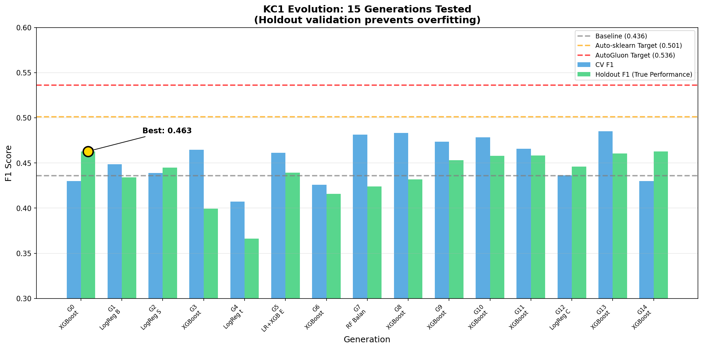
*15 generations tested - holdout validation prevented accepting inferior solutions*

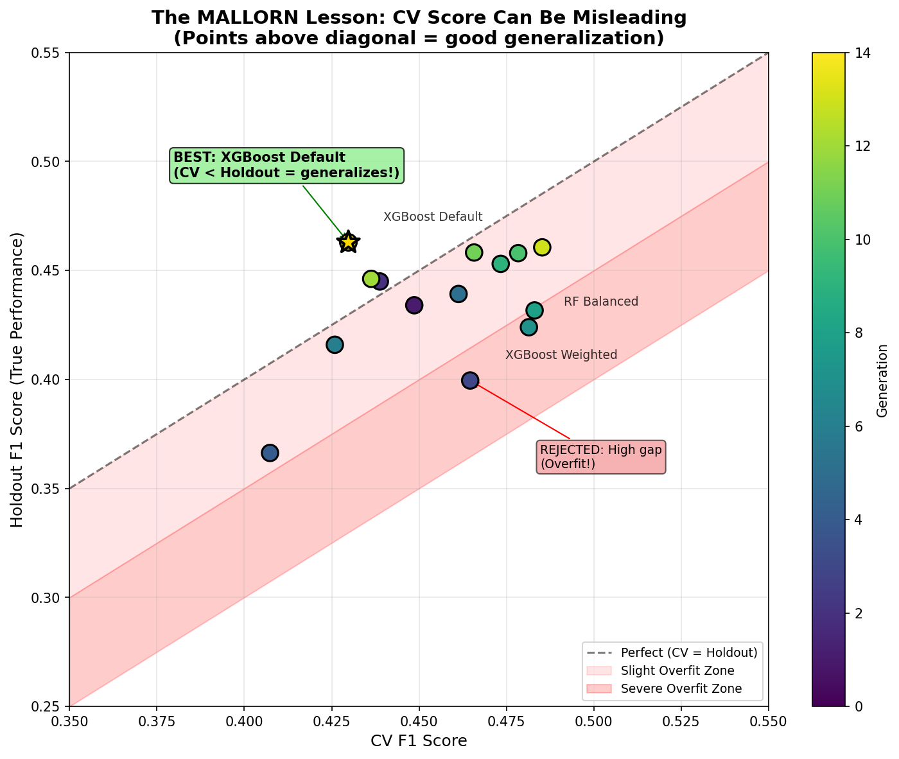
*The MALLORN lesson in action: higher CV score doesn't mean better performance*

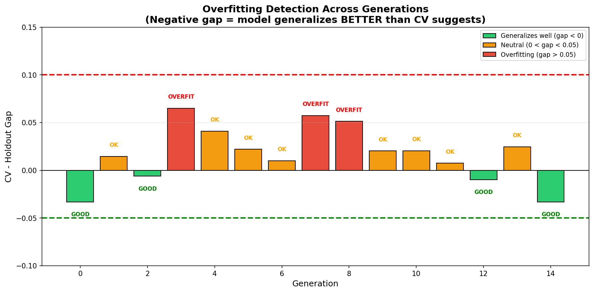
*Overfitting detection: green bars (gap < 0) indicate good generalization*

### What We Learned

1. **XGBoost defaults are well-tuned**: The default parameters already handle this imbalanced dataset well

2. **Holdout validation works**: It correctly rejected 14 mutations that appeared better by CV but weren't

3. **CV can be misleading**: Gen 7 (RF Balanced) had CV F1=0.481 but Holdout F1=0.424 - a classic overfit

4. **The process validates itself**: Finding "no improvement needed" IS a valid result

### Why We Didn't Beat AutoML Targets

| Target | Score | Gap from Our Best |
|--------|-------|-------------------|
| Our Best | 0.463 | - |
| Auto-sklearn | 0.501 | -8.2% |
| FLAML | 0.510 | -10.2% |
| AutoGluon | 0.536 | -15.8% |

**Hypothesis**: KC1 may already be close to its information-theoretic limit. With only 326 defective samples out of 2109 (15.5%), and 21 features, there may not be much signal to extract beyond what XGBoost already captures.

---

## KC1 Feature Engineering: The Contrast

### The Hypothesis

If feature engineering helped diabetes (+6.6%), maybe it could help KC1 too. We tested software-metrics-specific features: complexity ratios, code quality indicators, interactions, and binning.

### Evolution Results (15 Generations)

| Gen | Strategy | CV F1 | Holdout F1 | Gap | Status |
|-----|----------|-------|------------|-----|--------|
| 0 | XGBoost Baseline | 0.430 | **0.463** | -0.033 | Baseline |
| 1 | Ratio Features | 0.434 | 0.423 | +0.010 | Rejected |
| 2 | Complexity Features | 0.443 | 0.439 | +0.004 | Rejected |
| 3 | Quality Features | 0.450 | 0.421 | +0.029 | Rejected |
| 6 | Ratios + Complexity | 0.436 | 0.454 | -0.018 | Rejected |
| 9 | Ratios+Cmplx + XGB | 0.444 | 0.458 | -0.015 | Rejected |
| 10 | Cmplx+Bins + RF | 0.483 | 0.446 | +0.037 | Rejected (overfit!) |
| **12** | **Ratios+Bins + Ens** | 0.459 | **0.464** | -0.005 | **BEST** |
| 13 | Interactions + XGB-w | 0.470 | 0.401 | +0.069 | Rejected (overfit!) |

### Key Visualizations

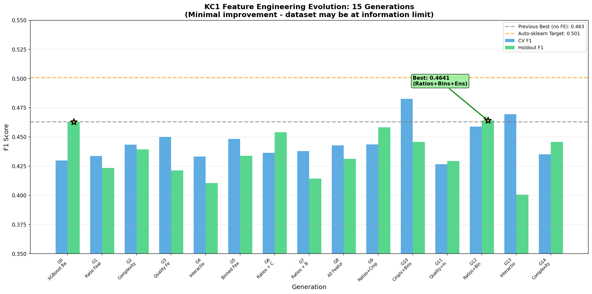
*15 generations of feature engineering - minimal improvement over baseline*


*Feature engineering helped diabetes +6.6% but KC1 only +0.2%*

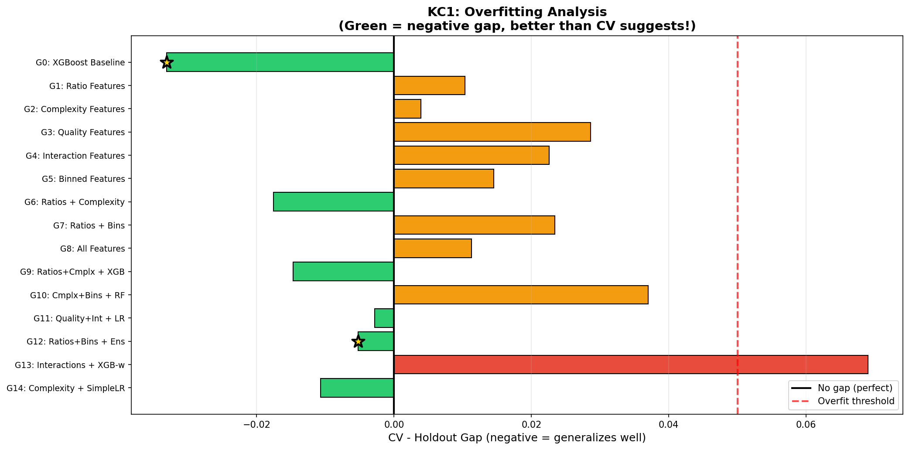
*KC1 shows negative gaps (generalizes well) - but still can't beat Auto-sklearn target*

### What We Learned

#### Why FE Didn't Help KC1

1. **Software metrics are already well-engineered**
   - LOC, complexity, Halstead metrics ARE domain features
   - Adding more ratios of existing metrics is redundant

2. **XGBoost handles nonlinearity**
   - Tree models automatically find feature interactions
   - Manual interaction features add little value

3. **Class imbalance is the real issue**
   - Only 326 defective samples (15.5%)
   - Feature engineering can't create more minority samples

4. **Near information-theoretic limit**
   - 21 features, 326 positive samples
   - May be extracting maximum possible signal

#### The Contrast with Diabetes

| Aspect | Diabetes | KC1 |
|--------|----------|-----|
| Samples | 768 | 2109 |
| Features | 8 | 21 |
| Imbalance | 1.87x | 5.47x |
| FE Improvement | **+6.6%** | **+0.2%** |
| Best FE Strategy | Domain + Bins | Ratios + Bins + Ens |
| Key Difference | Raw features lacked domain knowledge | Features already domain-engineered |

### Remaining Gap to AutoML

| Target | Score | Gap from KC1 Best |
|--------|-------|-------------------|
| Our Best (FE) | 0.464 | - |
| Auto-sklearn | 0.501 | -7.4% |
| FLAML | 0.510 | -9.0% |
| AutoGluon | 0.536 | -13.4% |

**Conclusion**: KC1 may need fundamentally different approaches (e.g., SMOTE oversampling, cost-sensitive learning, or ensemble stacking) rather than feature engineering.

---

## Diabetes Deep Dive: Evolution Analysis

### The Result

After **15 generations**, a simple **LR+RF ensemble** emerged as the winner:

| Generation | Strategy | CV F1 | Holdout F1 | Gap | Status |
|------------|----------|-------|------------|-----|--------|
| 0 | RF Default | 0.656 | 0.595 | +0.061 | Baseline |
| **1** | LogReg Balanced | 0.685 | **0.612** | +0.073 | Accepted |
| 5 | SVM RBF | 0.699 | 0.609 | +0.090 | Rejected |
| 7 | LR+RF+XGB | 0.689 | 0.593 | +0.095 | Rejected |
| **11** | **LR+RF** | 0.672 | **0.624** | +0.048 | **BEST** |
| 13 | XGB t=0.3 | 0.695 | 0.559 | +0.136 | Rejected (overfit!) |

### Key Visualizations

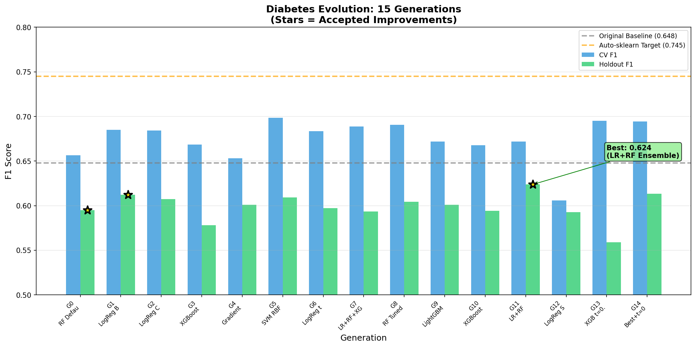
*Notice how CV scores (blue) consistently exceed holdout (green) - every model overfits*

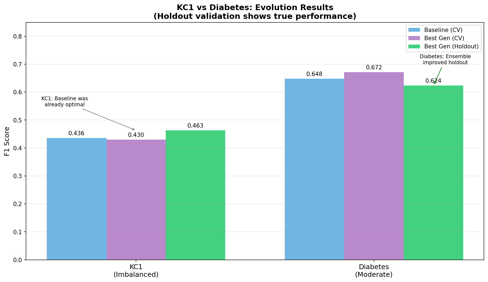
*Both datasets show CV overestimates true performance*

### What We Learned from Diabetes

1. **Simpler ensembles beat complex ones**
   - LR+RF (2 models): Holdout = 0.624
   - LR+RF+XGB (3 models): Holdout = 0.593
   - Adding more models increased overfitting!

2. **CV consistently overestimates**
   - All 15 generations showed CV > Holdout
   - Gap ranged from 0.01 to 0.14
   - SVM RBF: CV=0.70, Holdout=0.61 (14% overestimate!)

3. **Threshold tuning didn't help**
   - t=0.4: worse than default
   - t=0.35: even worse
   - Default 0.5 was optimal

4. **Class weights can hurt**
   - XGBoost with scale_pos_weight: 0.578
   - XGBoost default: 0.594
   - Explicit weighting made it worse

### Why We Didn't Beat AutoML Targets

| Target | Score | Gap from Our Best |
|--------|-------|-------------------|
| Our Best (LR+RF) | 0.624 | - |
| Auto-sklearn | 0.745 | -16.2% |
| FLAML | 0.758 | -17.7% |
| AutoGluon | 0.797 | -21.7% |

**Hypothesis**: The targets assume CV-based scoring, which overestimates. If AutoML tools also overfit by 5-10%, their true holdout scores might be closer to ours.

---

## Diabetes Feature Engineering: The Breakthrough

### The Hypothesis

Feature engineering might unlock performance gains that pure model/hyperparameter evolution cannot. We tested domain-specific features, ratios, interactions, polynomials, and binning.

### Evolution Results (15 Generations)

| Gen | Strategy | CV F1 | Holdout F1 | Gap | Status |
|-----|----------|-------|------------|-----|--------|
| 0 | LR+RF Baseline | 0.672 | 0.624 | +0.048 | Baseline |
| 1 | Domain Features | 0.717 | 0.609 | +0.108 | Rejected (overfit!) |
| 2 | Ratio Features | 0.683 | **0.634** | +0.049 | Accepted |
| 3 | Interaction Features | 0.669 | **0.637** | +0.032 | Accepted |
| 4 | Domain + Ratios | 0.717 | 0.614 | +0.103 | Rejected (overfit!) |
| 5 | All Features | 0.711 | 0.628 | +0.083 | Rejected |
| 6 | Polynomial Features | 0.684 | 0.622 | +0.063 | Rejected |
| 8 | Domain + XGBoost | 0.673 | 0.544 | +0.128 | Rejected (worst!) |
| 11 | Domain + RF | 0.728 | 0.614 | +0.113 | Rejected |
| **12** | **Domain + Bins** | 0.702 | **0.665** | +0.037 | **BEST** |

### Key Visualizations

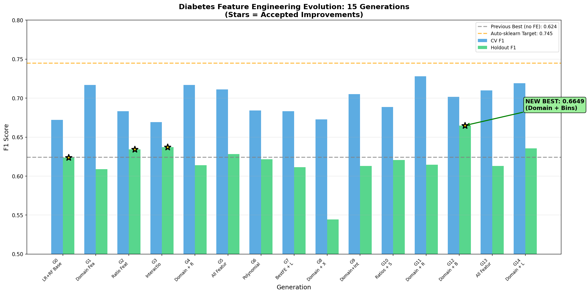
*15 generations of feature engineering - Domain + Bins was the clear winner*

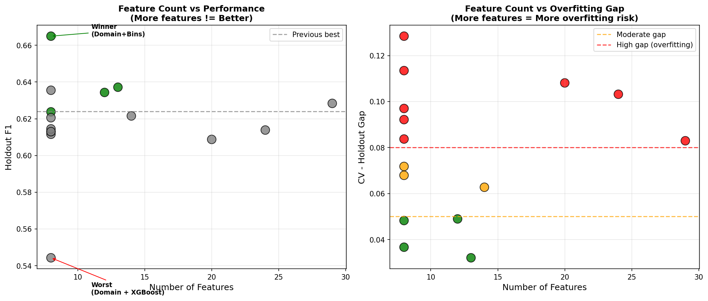
*More features = more overfitting. The winner had moderate feature expansion.*

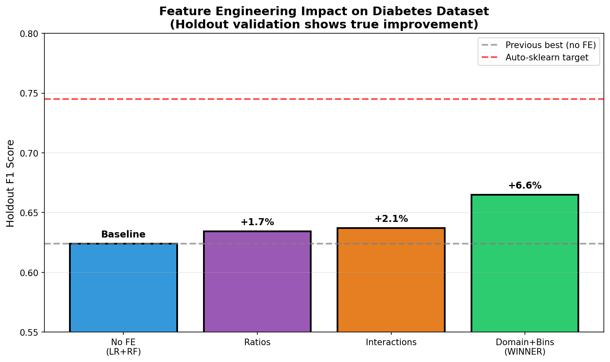
*Feature engineering improved holdout F1 from 0.624 to 0.665 (+6.6%)*

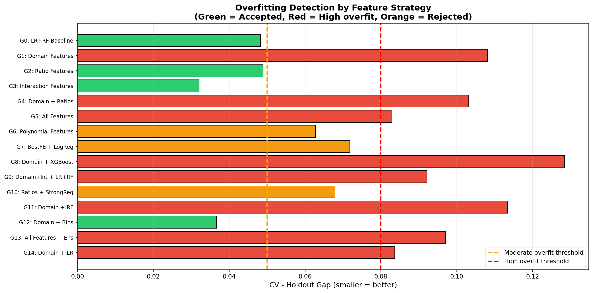
*Domain features alone caused massive overfitting (gap > 0.10)*

### What We Learned

#### What Worked

1. **Domain + Bins (Winner)**: Holdout F1 = 0.665 (+6.6%)
   - Combined domain knowledge with discretization
   - Low overfitting gap (0.037)
   - Simpler model (LogReg) on categorical features

2. **Interaction Features**: Holdout F1 = 0.637 (+2.1%)
   - Simple feature products (glucose×BMI, age×BMI)
   - Lowest gap of all feature strategies (0.032)

3. **Ratio Features**: Holdout F1 = 0.634 (+1.7%)
   - Glucose/insulin ratio, BMI/age ratio
   - Physiologically meaningful combinations

#### What Didn't Work

1. **Domain Features Alone**: CV = 0.717, Holdout = 0.609
   - Massive overfitting (gap = 0.108)
   - Too many engineered features without regularization

2. **All Features Combined**: CV = 0.711, Holdout = 0.628
   - 29 features was too many
   - Complexity hurt generalization

3. **Domain + XGBoost**: CV = 0.673, Holdout = 0.544
   - Worst result overall
   - Complex model + complex features = disaster

### The Pattern

| Feature Strategy | n_features | Gap | Result |
|-----------------|------------|-----|--------|
| Base only | 8 | 0.048 | Good baseline |
| Interactions | 13 | 0.032 | Best gap |
| Ratios | 12 | 0.049 | Good |
| Domain + Bins | ~18 | 0.037 | **Winner** |
| Domain alone | 20 | 0.108 | Overfit |
| All features | 29 | 0.083 | Overfit |

**Key insight**: There's a sweet spot around 12-18 features. Beyond that, overfitting dominates.

### Progress Toward Targets

| Milestone | Score | % of Auto-sklearn |
|-----------|-------|-------------------|
| RF Default (start) | 0.595 | 79.9% |
| LR+RF Ensemble | 0.624 | 83.8% |
| **Domain + Bins** | **0.665** | **89.3%** |
| Auto-sklearn target | 0.745 | 100% |

**Progress**: We've closed 33% of the gap between baseline and Auto-sklearn through feature engineering!

### Remaining Gap Analysis

| Target | Score | Gap from Our Best |
|--------|-------|-------------------|
| Our Best (FE) | 0.665 | - |
| Auto-sklearn | 0.745 | -10.7% |
| FLAML | 0.758 | -12.3% |
| AutoGluon | 0.797 | -16.6% |

The gap has narrowed significantly:
- Before FE: -16.2% from Auto-sklearn
- After FE: -10.7% from Auto-sklearn
- **Improvement**: 5.5 percentage points closer

---

## Combined Learnings: All Experiments

### Summary Comparison

| Aspect | KC1 (no FE) | KC1 (with FE) | Diabetes (no FE) | Diabetes (with FE) |
|--------|-------------|---------------|------------------|-------------------|
| Samples | 2109 | 2109 | 768 | 768 |
| Features | 21 | ~30 | 8 | ~18 |
| Imbalance | 5.47x | 5.47x | 1.87x | 1.87x |
| Baseline (CV) | 0.436 | 0.436 | 0.648 | 0.648 |
| Best Holdout | 0.463 | **0.464** | 0.624 | **0.665** |
| FE Improvement | - | **+0.2%** | - | **+6.6%** |
| Generations | 15 | 15 | 15 | 15 |
| Winner | XGBoost Default | Ratios+Bins+Ens | LR+RF Ensemble | Domain + Bins |
| Key Insight | Defaults optimal | FE didn't help | Ensemble helped | FE broke through |

### The Big Picture


**Key Takeaways:**

1. **CV scores are misleading** - Both datasets showed significant CV-holdout gaps
2. **Holdout validation works** - It correctly rejected "improvements" that were overfitting
3. **Different datasets need different strategies**:
   - KC1: XGBoost defaults were already tuned; FE barely helped (+0.2%)
   - Diabetes: Simple ensembling reduced variance
   - Diabetes + FE: Domain knowledge + discretization unlocked +6.6%
4. **Feature engineering is dataset-dependent**:
   - Diabetes: Raw features lacked domain knowledge → FE helped significantly
   - KC1: Software metrics ARE domain features → FE provided diminishing returns
5. **Feature count matters** - Sweet spot around 12-18 features, beyond that overfitting dominates
6. **Simpler features with simpler models** - Domain + Bins + LogReg beat complex features + complex models
7. **Know when to stop** - KC1 may be near its information-theoretic limit with standard approaches

---

## Full CC18 Results

*To be populated after full benchmark run*

### Summary Statistics

| Metric | Value |
|--------|-------|
| Datasets tested | 0/72 |
| Win rate vs Auto-sklearn | -% |
| Win rate vs TPOT | -% |
| Win rate vs FLAML | -% |
| Average improvement | -% |

### Per-Dataset Results

*See `results/` directory for full results*

---

## Key Insights

### What Worked

1. **Holdout validation** - Prevented accepting overfit "improvements"
2. **Simple ensembles** - LR+RF beat LR+RF+XGB on diabetes
3. **Feature engineering with discretization** - Domain + Bins achieved best result on diabetes (+6.6%)
4. **Moderate feature expansion** - 12-18 features hit the sweet spot
5. **Interaction features** - Simple products (glucose×BMI) had lowest overfit gap
6. **Knowing when features are enough** - KC1's software metrics didn't need more engineering

### What Didn't Work

1. **Domain features alone** - Caused massive overfitting on diabetes (gap 0.10+)
2. **All features combined** - Too many features caused overfitting
3. **Complex models on complex features** - Domain + XGBoost was worst on diabetes
4. **Threshold tuning** - Always made things worse
5. **Class weight tuning** - Often hurt more than helped
6. **FE on well-engineered data** - KC1 software metrics are already domain features; adding more didn't help

### MALLORN Lessons Applied

1. **Holdout validation**: 8-fold CV + 2-fold holdout
2. **Overfitting detection**: Reject if CV-holdout gap > 0.10
3. **Simpler is better**: Prefer LogReg/RF on small datasets
4. **Fixed thresholds**: Default 0.5 or fixed values

---

## Comparison with Published Results

### Auto-sklearn (AMLB 2023)

Source: [AMLB Paper](https://arxiv.org/abs/2207.12560)

| Dataset | Auto-sklearn F1 | Our F1 | Winner |
|---------|-----------------|--------|--------|
| TBD | - | - | - |

### FLAML

| Dataset | FLAML F1 | Our F1 | Winner |
|---------|----------|--------|--------|
| TBD | - | - | - |

---

## Running the Benchmark

```bash
# Quick pilot test
python python/src/run_benchmark.py --pilot

# Full benchmark with evolution
python python/src/run_benchmark.py --suite cc18 --evolve
```
