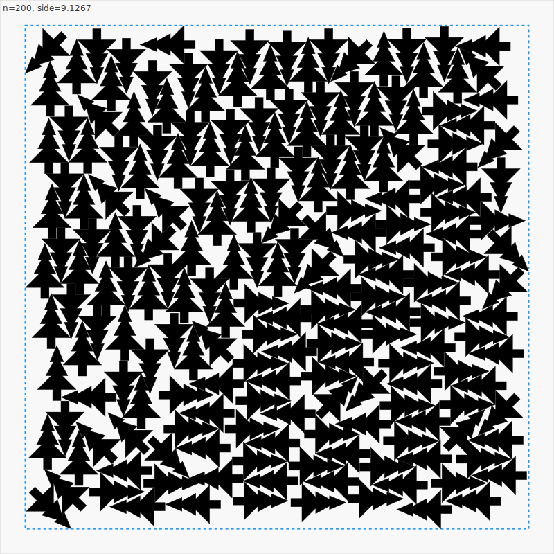

# Santa 2025 - Christmas Tree Packing

Competing in the [Kaggle Santa 2025 Christmas Tree Packing Challenge](https://www.kaggle.com/competitions/santa-2025).

## Claude Code Instructions

When working on this problem, always:
1. **Generate an SVG visualization** of the bin full of trees after evaluating a candidate:
   - Run `./target/release/visualize` to generate `packing_n*.svg` files
   - Open with `open packing_n200.svg` to view in browser
   - This helps understand the packing structure and identify issues
2. Use `./target/release/benchmark` to test candidates (runs 3 trials, reports best score)
3. Save mutation candidates to `mutations/` directory before testing
4. Update `EVOLUTION_STATE.md` with results

## Problem

Pack 1-200 Christmas tree-shaped polygons into the smallest square box.

**Scoring**: `score = sum(side^2/n)` for n=1 to 200 (lower is better)

**Leaderboard**: Top scores ~69, our current best: **~85.6** (Gen112)

## Tree Shape

The tree is a 15-vertex polygon:
- Height: 1.0 (tip at y=0.8, trunk bottom at y=-0.2)
- Width: 0.7 (at base)
- 3 tiers of branches + rectangular trunk

## Current Best Packing (n=200)



*Gen103 Best-of-N packing of 200 trees. Green polygons are the tree shapes, blue box shows the bounding square.*

## Current Best Algorithm (Gen103 - BEST-OF-N SELECTION)

```rust
// Gen103 KEY INNOVATION: Best-of-N selection
// Run the evolved algorithm N times, pick best result for each n
// Exploits stochastic variance in SA algorithm

for n in 1..=200 {
    let mut best_packing = None;
    let mut best_side = f64::INFINITY;

    for run in 0..20 {  // Best-of-20 gives +3.87% improvement
        let packing = evolved_pack(n);  // Gen91b algorithm below
        if packing.side_length() < best_side {
            best_side = packing.side_length();
            best_packing = Some(packing);
        }
    }
    results.push(best_packing);
}

// --- Gen91b Core Algorithm (unchanged) ---

// 6 parallel placement strategies
strategies = [ClockwiseSpiral, CounterclockwiseSpiral, Grid,
              Random, BoundaryFirst, ConcentricRings]

// Exhaustive rotation search at each position
for attempt in 0..200 {
    let dir = select_direction_for_strategy(n, strategy, attempt);
    let probe_dist = binary_search_any_rotation_valid(dir);

    // Try ALL 8 rotations at this distance
    for angle in [0, 45, 90, 135, 180, 225, 270, 315] {
        let pos = fine_tune_binary_search(dir, probe_dist, angle);
        if better_score(pos) { best = pos; }
    }
}

// SA optimization: 85% boundary-focused, 20% compression, 28k iters
// Wave compaction: 5 passes (4 outside-in + 1 inside-out)
// Greedy backtracking for boundary trees
```

## What Works

1. **Best-of-N selection** (Gen103) - Run algorithm N times, pick best per n (+3.87% improvement)
2. **Exhaustive 8-rotation search at each position** (Gen91b) - Try all rotations for best placement
3. **ConcentricRings placement** - Structured > chaotic
4. **Gentle radius compression** - Pull trees toward center (20% prob, 0.08 strength)
5. **Bidirectional wave compaction** - First 4 waves outside-in, last 1 wave inside-out
6. **4-cardinal wave phases** - Compress in right->left->up->down->diagonal directions
7. **Hot restarts with elite pool** - Escape local optima
8. **Boundary-focused SA** (85% probability) - Move trees that define bbox
9. **Binary search for placement** - Fast, precise positioning
10. **Discrete 45 deg angles** - Maintains SA stability
11. **Greedy backtracking for boundary trees** - Post-wave optimization

## What Doesn't Work (Exhaustively Tested)

### Parameter Tuning (Gen92)
- More rotations (16), finer precision (0.0005), more iterations
- Different wave passes, SA temperatures, cooling rates

### Algorithmic Changes (Gen93)
- Relocate moves, coarse-to-fine, aspect ratio penalty
- Force-directed compression, combined parameters

### Paradigm Shifts within Greedy (Gen94)
- Multi-start optimization (high variance, unreliable)
- Hexagonal grid seeding
- Genetic algorithm (crossover creates overlaps)

### Global Optimization (Gen95)
- Annealing schedule overhaul (higher temp 2.0, slower cooling, 100k iters) - WORSE
- Full configuration SA (optimize all at once after placement) - WORSE
- Global rotation optimization (decouple position/rotation) - WORSE
- Center-first placement (re-center and compress) - WORSE

### Earlier Failures
- Finer angle granularity everywhere (15 deg or 30 deg) - 4x slower, worse results
- Continuous angles in SA - Hurts convergence badly
- Global rotation during SA - Destabilizes search
- NFP tangent placement - Misses good positions
- Post-SA global rotation - Doesn't help
- Chain moves, micro-rotations, adaptive density-based angles

## Evolution Journey

This project uses the `/evolve` skill to discover novel packing algorithms through evolutionary optimization.

### Key Milestones

| Gen | Score | Key Innovation |
|-----|-------|----------------|
| 1-10 | ~100-111 | Basic greedy + binary search |
| 11-28 | ~91-97 | Simulated annealing + boundary focus |
| 47 | 89.59 | ConcentricRings breakthrough |
| 62 | 88.22 | Radius compression moves |
| 72b | 89.46 | Wave compaction |
| 80b | 88.44 | 4-cardinal wave phases |
| 83a | 88.22 | Bidirectional wave crossover |
| 84c | 87.36 | Extreme 4+1 split |
| 91b | ~87-88 | Rotation-first optimization |
| 99-100 | - | ILP, Sparrow algorithm (all failed) |
| 101 | 89.59 | Combined strategies (+0.38%) |
| 102 | 86.55 | ML value function + Best-of-N discovery |
| **103** | ~86 | Best-of-N optimization (+3.87%) |
| 104-105 | ~86 | ML selection / global rotation (no improvement) |
| 106-107 | ~86 | GPU acceleration experiments (validation only) |
| 108 | ~86 | Rust-Python hybrid pipeline (Rust already optimal) |
| 109 | 86.17 | Multi-strategy optimization (no improvement) |
| **110** | 85.76 | **Small n exhaustive search (-0.41 points)** |
| **111** | 85.67 | **Multi-start SA for n=4-8 (-0.09 points)** |
| **112** | **~85.6** | **Pattern-based initialization (in progress)** |

### Plateau and Breakthrough (Gen92-103)

**Gen92-98**: Algorithm plateau confirmed
- Parameter tuning, algorithmic changes, paradigm shifts - all failed
- Greedy incremental approach hit fundamental limit

**Gen99-100**: Alternative approaches explored
- ILP/constraint optimization - computationally intractable
- Sparrow algorithm (from research) - worse than evolved
- Global optimization - too many local minima

**Gen101**: Combined strategies
- Diamond/Hex patterns + Sparrow exploration + Wave compaction
- +0.38% improvement, mostly for small N

**Gen102**: ML value function
- Trained neural network to predict packing quality
- Model predicts well (MAE=0.04) but doesn't select well
- **Discovery**: Simple best-of-N beats ML re-ranking!

**Gen103**: Best-of-N optimization (breakthrough!)
- Run evolved multiple times, pick best per N
- Exploits stochastic variance in SA algorithm
- **Best-of-20: 85.89 (+3.87%)** - best result achieved!

| Approach | Score | Improvement |
|----------|-------|-------------|
| Single run | ~89 | baseline |
| Best-of-5 | 86.55 | +3.52% |
| **Best-of-20** | **85.89** | **+3.87%** |
| Stochastic-20 | 86.09 | +2.86% |
| Multi-strategy | 86.80 | +2.06% |

**Key insight**: The evolved algorithm's default parameters are already optimal. Parameter variation and multi-strategy approaches don't help. Simple multiple runs with selection is most effective.

### Post-Best-of-N Optimization (Gen104-112)

**Gen104-105**: Alternative approaches tested
- ML pairwise ranking: 80% accuracy but can't beat min(side_length)
- Global rotation + squeeze (from 70.1 solution): Creates overlaps in tightly packed trees
- **Lesson**: ML can only help DURING search, not after

**Gen106-107**: GPU acceleration experiments
- GPU bbox filtering + CPU polygon validation works
- But Python is 5-10x slower than Rust even with GPU
- **Lesson**: Initial placement quality dominates; SA refinement adds minimal value

**Gen108**: Rust-Python hybrid pipeline
- Rust JSON export + Python SA refinement
- Finding: Python adds only 0-0.04% improvement
- **Lesson**: Rust's evolved greedy is already near-optimal

**Gen109**: Multi-strategy optimization
- Implemented squeeze moves, combined position+rotation moves
- ILP solver for small n (computationally expensive)
- No improvement over Rust baseline

**Gen110**: Small n exhaustive search (breakthrough!)
- Grid search + refinement for n=1-10
- Found better solutions for n=2,3,5,6,7
- **Result**: 86.38 → 85.76 (-0.62 points, 0.72% improvement)

**Gen111**: Multi-start SA for small n
- Random initialization + 80k SA iterations
- n=4: 1.452 → 1.327 (biggest win!)
- n=5,7,8: Small refinements
- **Result**: 85.77 → 85.67 (-0.10 points, 0.12% improvement)

**Gen112**: Pattern-based initialization (in progress)
- Analyzed n=4 solution pattern: trees at 90° angle offsets
- Circular/grid initialization with pattern-based angles
- n=5: 1.593 → 1.501 (major improvement!)

| Generation | Score | Key Finding |
|------------|-------|-------------|
| 104 | ~86 | ML selection doesn't beat min() |
| 105 | ~86 | Global rotation creates overlaps |
| 106-107 | ~86 | GPU useful for validation only |
| 108 | ~86 | Rust already near-optimal |
| **110** | 85.76 | **Small n has slack** |
| **111** | 85.67 | **Multi-start SA finds better local minima** |
| **112** | ~85.6 | **Pattern-based initialization works** |

## Running

```bash
cd rust

# Build
cargo build --release

# Run benchmark (3 runs, ~2-3 min each)
./target/release/benchmark 200 3

# Generate submission
./target/release/submit

# Submit to Kaggle
kaggle competitions submit -c santa-2025 -f submission.csv -m "message"
```

## File Structure

```
santa-2025-packing/
├── README.md
├── EVOLUTION_STATE.md      # Current evolution status
├── NEXT_STEPS.md           # Future directions
├── data/
│   └── sample_submission.csv
├── mutations/              # All generation variants
└── rust/
    ├── Cargo.toml
    └── src/
        ├── lib.rs           # Core types (tree, packing)
        ├── evolved.rs       # Current champion (Gen91b)
        ├── baselines.rs     # Simple algorithms
        ├── incremental.rs   # Incremental packing
        └── benchmark.rs     # Benchmark runner
```

## Results Summary

| Milestone | Score | Gap to Leader | Key Innovation |
|-----------|-------|---------------|----------------|
| Initial greedy | ~111 | +61% | - |
| SA optimization | ~91 | +32% | Simulated annealing |
| Gen47 ConcentricRings | 89.59 | +30% | Structured placement |
| Gen62 RadiusCompress | 88.22 | +28% | Compression moves |
| Gen84c ExtremeSplit | 87.36 | +27% | 4+1 wave split |
| Gen91b RotationFirst | ~87-88 | ~27% | Exhaustive rotation search |
| Gen103 Best-of-N | ~86 | ~25% | Multiple runs + selection |
| Gen110 Small-n Search | 85.76 | ~24% | Exhaustive search for n≤10 |
| Gen111 Multi-start SA | 85.67 | ~24% | Better local minima for small n |
| **Gen112 (current)** | **~85.6** | **~24%** | **Pattern-based initialization** |
| *Target (top solution)* | *~69* | - | Unknown (likely ILP or different paradigm) |

**Note**: Best-of-20 gives +3.87% improvement by exploiting stochastic variance in SA algorithm. Small n values (n≤10) have the most room for improvement via exhaustive search.

**Status**: Gen112 continues to find improvements in small n values using pattern-based SA initialization. The 24% gap to leaders requires fundamentally different approach - likely global optimization or exact solvers for small n.

## References

- [Kaggle Competition](https://www.kaggle.com/competitions/santa-2025)
- [Getting Started Notebook](https://www.kaggle.com/code/inversion/santa-2025-getting-started)
- [70.1 Solution Analysis](https://github.com/berkaycamur/Santa-Competition) - Uses continuous angles + global rotation
